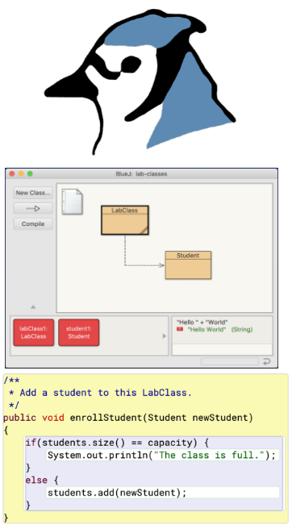
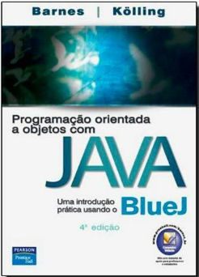
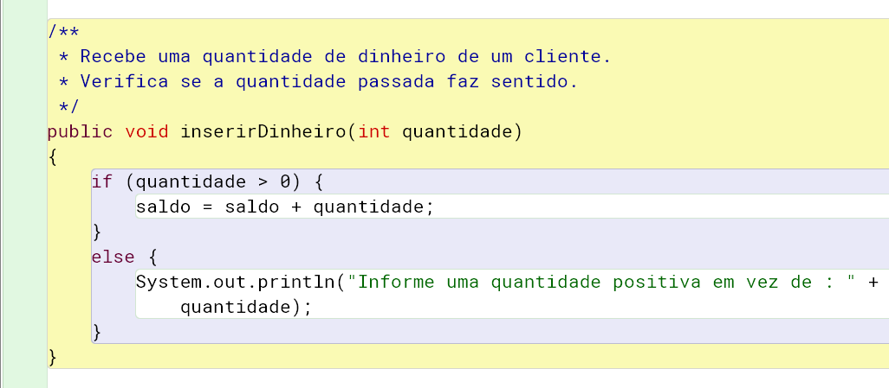

## Como estudar? 

. . .

Precisa repetir? :) 


- Como diz o ditado: *água mole em pedra dura tanto bate até que fura*.

##

Então vamos relembrar as [dicas]{.alert}:

:::: {.columns}

::: {.column width="70%"}

- É essencial **praticar enquanto estuda**, usando o BlueJ.
- Ajuda muito se você **ler o** capítulo do **livro** da disciplina para tirar dúvidas e complementar o que está sendo estudado.
- Use um caderno e caneta para [anotar]{.alert} os principais [conceitos]{.alert} e eventuais [dúvidas]{.alert} que surgirem.

:::

::: {.column width="30%"}
{fig-alt="Prints do BlueJ." width=50%}
{fig-alt="Capa do livro do Barnes e Kolling." fig-align="left" width=50%}
:::

::::

# Design da Máquina de Ingressos {background-color="#40666e"}

## 

Nas aulas anteriores você deve ter percebido que a **classe `MaquinaIngressos`** não serviria muito no mundo real, já que ela **tem vários problemas**.

- Não verifica se o cliente colocou dinheiro suficiente para comprar o ingresso.
- Não retorna troco se o cliente colocou mais dinheiro que o necessário.
- Não verifica se a quantidade de dinheiro faz sentido (aceita valor negativo, por exemplo).
  - E o mesmo para o preço do ingresso (passado para o construtor).

##

Corrigindo isso, teríamos um software que realmente poderia servir de base para uma máquina de ingressos real.

- Vamos então avaliar o **projeto [maquina-ingressos-melhor](https://github.com/ufla-ipoo/maquina-ingressos-melhor)**, que tenta resolver os problemas apontados.

. . .

Antes de analisarmos o código, **experimente**:

- criar uma máquina de ingressos e chamar seus métodos, **verificando o que funciona de forma diferente**.
- Veja, por exemplo, que há um novo método `retornarTroco`. Veja o que acontece quando ele é chamado.

# Comando Condicional {background-color="#40666e"}

## 

Dê uma olhada no código da classe `MaquinaIngressos` do novo projeto.

- Veja que o nome da classe, os atributos, o construtor e os métodos de acesso são os mesmos da versão anterior.
- A primeira mudança está no método `inserirDinheiro`.

##

Veja que o método possui um tratamento para evitar que o usuário insira quantidades negativas de dinheiro.

. . .

::: {.halfincfontsize}
```{.java code-line-numbers="false"}
public void inserirDinheiro(int quantidade)
{
    if (quantidade > 0) {
        saldo = saldo + quantidade;
    }
    else {
        System.out.println("Informe uma quantidade 
            positiva em vez de : " + quantidade);
    }
}
```
:::

##

Um outro exemplo de **comando condicional** pode ser encontrado no método `imprimirIngresso`.

. . .

```{.java code-line-numbers="false"}
    if (saldo >= preco) {
        // ... detalhes de impressão omitidos ...
        // Atualiza o total coletado com o saldo
        total = total + preco;
        // Reduz o saldo de acordo com o preço do ingresso
        saldo = saldo - preco;
    }
    else {
        System.out.println("Você precisa inserir pelo menos mais : " +
            (preco - saldo) + " centavos.");
    }
```

. . .

Com ele, corrigimos o problema da versão ingênua da máquina

- de não verificar se o cliente tinha inserido quantidade suficiente de dinheiro antes de imprimir o ingresso.

##

```{.java code-line-numbers="false"}
    if (saldo >= preco) {
        // ... detalhes de impressão omitidos ...
        // Atualiza o total coletado com o saldo
        total = total + preco;
        // Reduz o saldo de acordo com o preço do ingresso
        saldo = saldo - preco;
    }
    else {
        System.out.println("Você precisa inserir pelo menos mais : " +
            (preco - saldo) + " centavos.");
    }
```

Se o valor do atributo `saldo` é maior, ou pelo menos igual, ao atributo `preco`.

- O ingresso é impresso.
- Caso contrário, é exibida uma mensagem de erro.

##

Repare que a mensagem de erro segue o mesmo padrão que já vimos antes, é apenas mais _verboso_.

```{.java code-line-numbers="false"}
    System.out.println("Você precisa inserir pelo menos mais : " +
        (preco - saldo) + " centavos.");
```

. . .

Quantos parâmetro o método `println` está recebendo?

- Apenas um!
- Uma string formada pela concatenação do texto, mais o resultado da conta `preco - saldo`,
  mais o final do texto.

##

::: {.callout-note title="Exercício" icon=false}
No método `imprimirIngresso`, o que acontece se removermos os parênteses do cálculo `preco - saldo`?

Por que isso acontece?
:::

. . .

::: {.callout-note title="Exercício" icon=false}
Compare a implementação do método `imprimirIngresso` no projeto `maquina-ingressos-melhor` com o projeto anterior.
Experimente com o BlueJ situações iguais nos dois projetos e compare o que acontece.
Repare que, além de ter um comando condicional, o total e o saldo são atualizados de forma diferente.
:::

. . .

::: {.callout-note title="Exercício" icon=false}
Seria possível remover o bloco `else` do método `imprimirIngresso`?
Qual seria o efeito para o usuário, quando ele tentasse imprimir um ingresso sem inserir quantidade suficiente de dinheiro.
:::

##

::: {.callout-note title="Exercício" icon=false}
Avalie a implementação do método `retornarTroco`.
Experimente colocar mais dinheiro que o necessário para um ingresso, imprima um ingresso e então chame o método `retornarTroco`.
Tente também chamar o método quando não há saldo de dinheiro disponível.
:::

##

O **comando** [if-else]{.alert} tem duas formas

- ambas são controladas pela avaliação de uma expressão booleana.

. . .

:::: {.columns}

::: {.column width="50%"}
::: {.halfincfontsize}
```{.java code-line-numbers="false"}
if (expressão) {
    comandos
}
```
:::
:::

::: {.column width="50%"}
::: {.halfincfontsize}
```{.java code-line-numbers="false"}
if (expressão) {
    comandos
}
else {
    comandos
}
```
:::
:::

::::

##

:::: {.columns}

::: {.column width="50%"}
::: {.halfincfontsize}
```{.java code-line-numbers="false"}
if (expressão) {
    comandos
}
```
:::
:::

::: {.column width="40%"}
::: {.halfincfontsize}
```{.java code-line-numbers="false"}
if (expressão) {
    comandos
}
else {
    comandos
}
```
:::
:::

::::

:::: {.columns}
::: {.column width="40%"}
- Na primeira forma, o valor da expressão booleana é usado para decidir se os comandos serão executados ou não.
:::

::: {.column width="50%"}
- Na segunda, a expressão é usada para escolher entre duas alternativas, e somente uma delas é executada.
:::
::::

## Exemplos

. . .

Do primero caso:

::: {.halfincfontsize}
```{.java code-line-numbers="false"}
if (texto.size() == 0) {
    System.out.println("O texto está vazio.");
}
```
:::

. . .

Do segundo:

::: {.halfincfontsize}
```{.java code-line-numbers="false"}
if (numero < 0) {
    infomarErro();
}
else {
    processarNumero();
}
```
:::

##

É muito comum **juntar comandos** [`if-else`]{.alert} colocando um segundo `if-else` na bloco `else` do primeiro.

- Isso pode ser feito várias vezes.
- E é uma boa ideia sempre incluir uma parte `else` ao final.

::: {.halfincfontsize}
```{.java code-line-numbers="false"}
if (n < 0) {
    tratarValorNegativo();
}
else if (n == 0) {
    tratarZero();
}
else {
    tratarValorPositivo();
}
```
:::

##

Já o **comando** [switch]{.alert} permite avaliar um valor e, a partir dele, tratar qualquer número de casos.

- Existem duas formas principais de uso.

. . .

:::: {.columns}

::: {.column width="50%"}
```{.java code-line-numbers="false"}
switch(expressão) {
    case valor: 
        comandos;
        break;
    case valor: 
        comandos;
        break;
    // pode ter mais casos
    default: 
        comandos;
        break;
}
```
:::

::: {.column width="50%"}
```{.java code-line-numbers="false"}
switch(expressão) {
    case valor1:
    case valor2:
    case valor3:
        comandos;
        break;
    case valor4: 
    case valor5:
        comandos;
        break;
    // pode ter mais casos
    default: 
        comandos;
        break;
}
```
:::

::::

##

Algumas obsevações sobre o comando `switch`:

- Ele pode ter qualquer número de casos (`case`).
- O comando `break` é necessário para evitar que execução continue para o próximo caso.
  - A segunda forma de uso apriveita disso para que os três primeiros valores levem ao mesmo bloco de comandos.
- O comando `default` é opcional, ele evita que nada seja executado se o valor não for de nenhum dos casos anteriores.
- Tanto a expressão do `switch` quanto os rótulos dos casos podem ser strings.

## Exemplos

```{.java code-line-numbers="false"}
switch(dia) {
    case 1: diaDaSemana = "domingo";
        break;
    case 2: diaDaSemana = "segunda-feira";
        break;
    case 3: diaDaSemana = "terça-feira";
        break;
    case 4: diaDaSemana = "quarta-feira";
        break;
    case 5: diaDaSemana = "quinta-feira";
        break;
    case 6: diaDaSemana = "sexta-feira";
        break;
    case 7: diaDaSemana = "sábado";
        break;
    default: diaDaSemana = "dia inválido";
        break;
}
```

## Exemplos

```{.java code-line-numbers="false"}
switch(siglaDoDia.toLowerCase()) {
    case "seg":
    case "ter":
    case "qua":
    case "qui":
    case "sex":
        vaiTrabalhar();
        break;
    case "sab":
    case "dom":
        ficaNaCama();
        break;
}
```

# _Scope Highlighting_ {background-color="#40666e"}

##

Ao avaliar o código de uma classe no BlueJ, você deve ter notado que ele mostra caixas coloridas ao redor de alguns elementos.

- Como ao redor dos blocos e comandos condicionais, por exemplo.

{fig-alt="Print do método inserirDinheiro como é exibod no BlueJ."  width=80%}

##

Esses destaques coloridos são chamados de [*scope highlighting*]{.alert} (ou destaque de escopo).

- Eles nos ajudam a entender as unidades lógicas do programa.
- Um escopo, ou bloco, é o código que existe entre um par de chaves.
  - O corpo de uma classe é um escopo.
  - O corpo de cada método também é um escopo.
  - E mesmo a parte do `if` de um comando condicional também é um escopo.
  - Portanto, podemos ter escopos aninhados (ou seja, um dentro do outro).

## 

O BlueJ nos ajuda a identificar os escopos usando cores diferentes para cada um.

:::: {.columns}

::: {.column width="50%"}

:::

::: {.column width="50%"}
- Na imagem vemos com fundo branco os escopos de cada bloco do `if` e `else`.
- Com fundo roxo, o escopo do comando condicional.
- Com fundo amarelo o escopo do método.
- E com fundo verde o escopo da classe.
:::

::::

## 

Um erro muito comum para quem está começando é esquecer de fechar as chaves, ou colocar uma chave em um lugar errado.

- As cores do BlueJ nos ajudam a identificar esse tipo de problema.
- Além disso, é muito importante [indentar]{.alert} o código, usando tabulação para cada bloco de código (cada trecho entre chaves).

. . .

:::: {.columns}

::: {.column width="20%"}

:::

::: {.column width="80%"}
::: {.callout-note title="Convenção" appearance="simple" icon=false}
Se a sua indentação estiver ficando uma bagunça, o BlueJ pode te ajudar.
Experimente alterar o código e forma que a indentação fique errada e depois a corriga automaticamente, acessando o menu **Editar &rarr; Auto-indentação** do editor de código do BlueJ.
:::
:::

::::

##

::: {.callout-note title="Exercício" icon=false}
Experimente remover uma chave do código da classe `MaquinaIngressos` e repare o que é alterado nas cores de fundo do editor de código.
Experimente também inserir uma chave onde ela não seria esperada.
:::

. . .

::: {.callout-note title="Exercício" icon=false}
Escreva um trecho de código em Java que compara o valor das variáveis `preco` e `estimativa`.
Se o preço for maior que a estimativa, deve ser exibida a mensagem `Muito caro.`.
Se o preço estiver abaixo da estimativa, a mensagem exibida deve ser `Bora comprar, tá barato.`.
Por fim, se o preço for exatamente igual à estimativa, exiba a mensagem `Na mosca!`.
:::


# Variáveis locais {background-color="#40666e"}

## 

Até agora usamos dois tipos de variáveis: **atributos** (variáveis de instância) e **parâmetros**.

- Vamos agora conhecer um **terceiro tipo**.
- O que os três tipos têm em comum?
  - Todas eles servem para armazenar dados, mas cada um tem um objetivo diferente.

##

Repare o código do método `retornarTroco`.

- Ele possui três comandos e uma declaração (da variável `troco`).

::: {.doublefontsize}
```{.java code-line-numbers="false"}
public int retornarTroco()
{
    int troco;
    troco = saldo;
    saldo = 0;
    return troco;
}
```
:::

## 

Como podemos saber que a variável `troco` não é um atributo?

- Por que atributos são declarados fora dos métodos (diretamente no escopo da classe).

. . .

E como sabemos que ela não é um parâmetro?

- Por que parâmetros são declarados na assinatura dos métodos e construtores.

. . .

A variável `troco` é de um terceiro tipo: ela é uma [variável local]{.alert}.

##

A variável `troco` é de um terceiro tipo: ela é uma [variável local]{.alert}.

- Tem esse nome porque ela é declarada dentro do corpo de um método.
- E, portanto, tem um escopo *local*
  - do método, ou do bloco onde é declarada.

##

Variáveis locais são declaradas como os atributos

- mas sem os modificadores *public* e *private*.

. . .

E a principal **diferença é o** [tempo de vida]{.alert}.

- Variáves locais existem somente durante a execução do método.
- Diferente dos atributos que existem na memória enquanto o objeto existir.

## 


##

Nós **evitamos** declarar como **atributos** variáveis que **não precisam ser mantidas em memória** depois que o método é chamado.

- Repare que atributos são características dos objetos.
- Já variáveis locais são apenas informações temporárias usadas para fazer algo durante a execução de um método.
- Portanto, se algo só precisa existir durante a execução do método, declará-lo como atributo desperdiçaria memória e feriria o conceito de objetos.

## 

Nós usamos **variáveis locais** mesmo quando dois métodos na mesma classe têm variáveis locais com o mesmo objetivo.

- Muitas vezes até com o mesmo nome.

. . .

É tentador declarar como atributo para *"reaproveitar"* a mesma declaração.

- Mas, não devemos usar atributos para valores que não precisam existir depois da chamada dos métodos.

##

Por exemplo:

- No método `retornarTroco`, a variável `troco` é usada, temporariamente, apenas para guardar o valor do saldo antes dele ser zerado.
- Depois que o método é finalizado, não faz mais sentido guardar o valor do troco.

##

::: {.halfincfontsize}
::: {.callout-note title="Cuidado" appearance="simple" icon=false}
Se você declarar uma variável local (ou um parâmetro) com o mesmo nome de um atributo, você não conseguirá acessar o atributo dentro
do método ou construtor onde a variável local foi declarada.

No capítulo 3 aprenderemos um jeito de lidar com isso, se necessário.
:::
:::

##

::: {.callout-note title="Exercício" icon=false}
Porque a implementação alternativa do método `retornarTroco` abaixo não dá o mesmo resultado da original?
Faça testes que mostrem como o funcionamento é diferente.

::: {.halfincfontsize}
```{.java code-line-numbers="false"}
public int retornarTroco()
{
    saldo = 0;
    return saldo;
}
```
:::
:::

. . .

::: {.callout-note title="Exercício" icon=false}
Altere o método `retornarTroco` usando a implementação abaixo. O código compila? Se não, explique porque não compila.

::: {.halfincfontsize}
```{.java code-line-numbers="false"}
public int retornarTroco()
{    
    return saldo;
    saldo = 0;
}
```
:::
:::

##

::: {.callout-note title="Exercício" icon=false}
O que há de errado com a implementação alternativa abaixo do construtor da classe `MaquinaIngressos`?

::: {.halfincfontsize}
```{.java code-line-numbers="false"}
public MaquinaIngressos(int custoIngresso)
{    
    int preco = custoIngresso;
    saldo = 0;
    total = 0;
}
```
:::

Tente usar essa versão. O código compila?

Crie um objeto e inspecione o valor dos atributos. 

Há algo de errado com o atributo `preco`?

Consegue explicar o que aconteceu?
:::


## Quiz 2.5 {background-color="#f7fad1"}

::: {.nonincremental}
[O tempo de vida de uma variável local é:]{.alert}

a. O mesmo do programa.
b. O mesmo da classe.
c. O mesmo do objeto.
d. O mesmo do método ou construtor.
:::

## Quiz 2.6 {background-color="#f7fad1"}

::: {.nonincremental}
[Escolha a melhor opção para completar a frase: Uma variável local é acessível ________:]{.alert}

a. em qualquer classe do programa.
b. na classe onde é declarada.
c. no método ou construtor onde é declarada.
d. no bloco de código onde é declarada.
:::

# Atributos, parâmetros e variáveis locais {background-color="#40666e"}

## 

É importante entender as semelhanças e diferenças entre **atributos, parâmetros e variáveis locais**.

- Os três servem para armazenar valores de acordo com seu tipo.
- Mas possuem diferenças importantes, como mostrado na tabela a seguir.

##

::: {style="margin-left: 0 !important; position: relative; left: -80px; margin-right: auto;"}
|     | [Atributos]{.alert} | [Parâmetros]{.alert} | [Variáveis locais]{.alert} |
| --- | :---: | :---: | :---: |
| **Declaração**    | fora dos métodos e construtores | na assinatura de métodos/construtores | no corpo dos métodos/construtores |
| **Tempo de vida** | do objeto | do método/construtor | do método/construtor |
| **Escopo**        | acessível em qualquer lugar da classe | acessível no método/construtor | acessível no bloco onde é declarada |
| **Valor padrão**  | Sim | Não (valor é passado de fora do objeto) | Não (precisa ser inicializada antes de ser usada) |
:::

##

:::: {.columns}

::: {.column width="20%"}

:::

::: {.column width="80%"}
::: {.callout-note title="Dica" appearance="simple" icon=false}
Se estiver em dúvida se uma variável deve ser declarada como atributo ou variável local:

- Dê preferência sempre a declará-la como variável local.
- Só declare como atributo se tiver certeza que:
  1. É uma informação que precisa ser mantida mesmo depois da chamada do método.
  2. É uma característica do objeto (algo que o descreve/representa).
:::
:::

::::

##

::: {.callout-note title="Exercício" icon=false}
Adicione um novo método `esvaziar` à classe `MaquinaIngressos`.
Você já tinha feito isso na aula passada no projeto anterior, mas, agora, além zerar o valor do atributo
`total`, o método deve retornar o valor do total antes dele ser zerado.
:::

. . .

::: {.callout-note title="Exercício" icon=false}
Altere o método `imprimirIngresso` criando uma **variável local** chamada `valorQueFalta`.
A variável deve receber a diferença entre o preço e o saldo, ou seja, o valor que falta para completar o preço de um ingresso.
Altere o comando condicional para que o teste seja feito verificando o valor da variável `valorQueFalta`,
e utilize a variável também na mensagem dada quando não há dinheiro suficiente para comprar um ingresso.

Teste as alterações criando situações que caiam tanto no bloco `if` quanto no bloco `else`, para garantir que tudo está funcionando como deveria.
:::

##

::: {.callout-note title="(Opcional) Exercício - [Desafio]{.alert}" icon=false}
Salve o projeto da máquina de ingressos com um novo nome (ex.: `maquina-ingressos-varios-precos`).

Altere a classe `MaquinaIngressos` do novo projeto de forma que ela possa emitir ingressos de preços diferentes.
Imagine que a máquina real tenha um botão que permite ao usuário escolher uma opção de ingresso com desconto, antes de solicitar a impressão do ingresso.

Quais atributos e métodos precisariam ser adicionados à classe para tratar isso?

Você acha que seria necessário alterar muitos dos métodos que já existiam?
:::

# Reforçando conceitos {background-color="#40666e"}

# 

Para reforçar os novos conceitos que aprendemos, vamos revisitar o projeto [disciplina](https://github.com/ufla-ipoo/disciplina) que estudamos no capítulo 1.

. . .

Abra o projeto e leia com cuidado o código da classe `Estudante`, tentando responder às perguntas abaixo.

- Quais são as informações que precisam ser guardadas enquanto o estudante existir?
- Quando um objeto é criado, quais informações são recebidas de fora e quais são inicializadas com um valor fixo?
- Quais informações podem ser consultadas de fora do objeto?
- E quais podem ser alteradas depois que o objeto é criado?


# 

Veja que o nome, a matrícula e o número de créditos do estudante são as informações que devem **ficar guardadas enquanto o objeto estudante existir**.

- Portanto, essas informações devem ser declaradas como [atributos]{.alert} da classe.

. . .

Os atributos `nome` e `matricula` são inicializados no **construtor a partir** de valores recebidos por [parâmetro]{.alert}.

- Já o número de `creditos` é inicializado com um valor fixo.

##

Os três atributos possuem [métodos de acesso]{.alert} (métodos *obter*).

- O número de matrícula não pode ser alterado (é **imutável**), já nome e número de créditos podem ser alterados por [métodos modificadores]{.alert}.

# Chamando métodos {background-color="#40666e"}

## 

O método `obterLogin` da classe `Estudante` tem algo diferente que é interessante analisarmos.

::: {.halfincfontsize}
```{.java code-line-numbers="false"}
  public String obterLogin()
  {
    return nome.substring(0,4) + matricula.substring(0,3);
  }
```
:::

. . .

Repare em dois pontos interessantes:

1. Estamos chamando métodos de outro objeto que retornam resultados.
2. Os resultados retornados são usados como parte de uma expressão.

## 

Os atributos `nome` e `matricula` são objetos `String`.

- E a classe `String` possui um método chamado `substring`.

. . .

O método substring tem o seguinte comentário e assinatura.

::: {.halfincfontsize}
```{.java code-line-numbers="false"}
/*
* Returns a string that is a substring of this string. 
* The substring begins at the specified beginIndex 
* and extends to the character at index endIndex - 1. 
* Thus the length of the substring is endIndex-beginIndex.
*/
public String substring(int beginIndex, int endIndex)
```
:::

##

Pelo comentário vemos que o método retorna uma string que é parte da string original.

- A string retornada inclui os caracteres que estão da posição `beginIndex` (primeiro parâmetro) até a posição **anterior** a `endIndex` (segundo parâmetro).

. . .

Sabendo disso, vamos entender como o método `obterLogin` funciona.

## 

A primeira parte da expressão implementada é `nome.substring(0,4)`.

- Pelo que vimos do método `substring`, isso significa que são retornados os quatro primeiros caracteres do nome do estudante (da posição 0 até a posição 3).

. . .

Já a segunda parte da expressão é `matricula.substring(0,3)`. O que ela retorna?

- Os três primeiros caracteres da matrícula.

##

Portanto, para um aluno de nome **"Sebastião da Silva"** e matrícula **435221**, qual seria o valor retornado pelo método `obterLogin`?

- Pense primeiro na resposta e depois valide criando um objeto no BlueJ.
- Veja que o retorno seria **"Seba435"**.

##

::: {.callout-note title="Exercício" icon=false}
Qual seria o login retornado para uma estudante chamada **"Maria Pereira"**, com matrícula **332211**?
:::

. . .

::: {.callout-note title="Exercício" icon=false}
Crie um `Estudante` com o nome `"Teo"` e matrícula `"748392"`.
O que acontece quando o método `obterLogin` é chamado para este estudante?
Por que você acha que isso acontece?
:::

## 

::: {.callout-note title="Exercício" icon=false}
A classe `String` possui um método de acesso chamado `length`, com o seguinte cabeçalho:

::: {.halfincfontsize}
```{.java code-line-numbers="false"}
/**
 * Return the number of characters in this string.
 * (tradução: retorna o número de caracteres nesta string.)
 */
public int length()
```
:::

Adicione um comando condicional ao construtor da classe `Estudante` e imprima um erro na tela caso o 
parâmetro `nomeCompleto` tenha menos que quatro caracteres, ou o parâmetro `matriculaEstudante` tenha menos
de três caracteres.

Obs.: mesmo que a mensagem seja exibida, o objeto deve ser criado normalmente com os valores passados.
:::

##

::: {.callout-note title="Exercício - [Desafio]{.alert}" icon=false}
Altere o método `obterLogin` da classe `Estudante` de forma que ele sempre retorne um login, 
mesmo que os atributos `nome` e `matricula` não tenham os tamanhos mínimos esperados.
Caso algum atributo tenha tamanho insuficiente, use todos os caracteres do atributo.
:::

# Experimentando o Bloco de Códigos (_Code Pad_) do BlueJ {background-color="#40666e"}

## 

É muito comum precisarmos implementar expressões em nossos códigos.

- Como cálculos usando variáveis.
- Ou chamadas de métodos de variáveis que são objetos.
- O **Bloco de Códigos** do BlueJ pode ser muito útil para experimentarmos expressões antes de as implementarmos em nossas classes.

##

Tente adivinhar os resultados das expressões abaixo, antes de usar o Bloco de Códigos.

- `2023 + 4`
- `"passa" + "tempo"`
- `"passa" + 9`
- `7 + 2 + "tempo"`
- `"tempo" + 7 + 2`
- `"passatempo".substring(5,6)`
- `"passatempo".substring(5,11)`

. . .

O que foi novidade para você nesse exercício?

## 

No Bloco de Códigos, quando o resultado de uma expressão é um objeto (como uma `String`), aparece um símbolo vermelho próximo ao resultado.

- Você pode clicar duas vezes no símbolo para inspecionar o objeto.
- Ou clicar uma vez para colocá-lo na bancada de objetos.
- Experimente!

##

Você pode também declarar variáveis e escrever comandos completos no Bloco de Códigos.

- Experimente os comandos abaixo:
- `soma = 2023 + 4;`
- `int soma = 0;`
- `soma = 2023 + 4;`

. . .

Se você digitar o nome de uma variável sem ponto-e-vírgula, o Bloco de Códigos exibe seu valor.

- Experimente digitar, por exemplo: `soma`

## 

::: {.callout-note title="Exercício" icon=false}
Abra o projeto [maquina-ingressos-melhor](https://github.com/ufla-ipoo/maquina-ingressos-melhor) e digite o código abaixo.
Veja que tem linhas que terminam com ponto-e-virgula e outras não.
**Preste atenção** ao valor retornado pelo método `obterSaldo` em cada chamada.

::: {.halfincfontsize}
```{.java}
MaquinaIngressos m1 = new MaquinaIngressos(1000);
m1.obterSaldo()
m1.inserirDinheiro(500);
m1.obterSaldo()
```
:::
:::

. . .

::: {.callout-note title="Exercício" icon=false}
Agora digite a linha abaixo no Bloco de Códigos.

::: {.halfincfontsize}
```{.java}
MaquinaIngressos m2 = m1;
```
:::

O que você acha que a chamada `m2.obterSaldo()` retornaria?

Experimente!
:::

##

::: {.callout-note title="Exercício" icon=false}
Agora digite o comando abaixo

::: {.halfincfontsize}
```{.java}
m1.inserirDinheiro(500);
```
:::

Avalie a linha abaixo e tente adivinhar o que ela vai retornar antes de digitar o código no Bloco de Códigos.

::: {.halfincfontsize}
```{.java}
m2.obterSaldo()
```
:::

A resposta foi a que você esperava?

Você consegue imaginar alguma ligação entre `m1` e `m2` que explique o que está acontecendo?
:::

## 

O que parece ter acontecido no exercício anterior?

- Veja que a atribuição `m2 = m1` faz com que as duas variáveis referenciem (ou apontem para) o mesmo objeto.
- Isso porque variáveis de tipo objeto em Java são na verdade ponteiros.
- Portanto, a atribuição copia o endereço de memória que a variável `m1` guarda, para a variável `m2`.
- E assim, como agora `m2` guarda o mesmo endereço de `m1`, ambas estão apontando para o mesmo objeto.