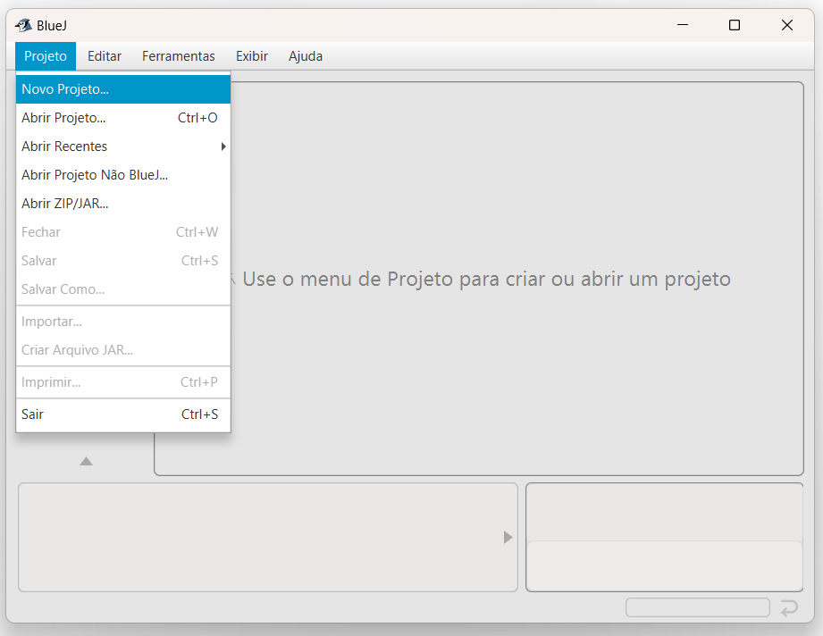
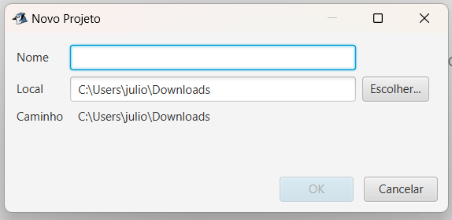
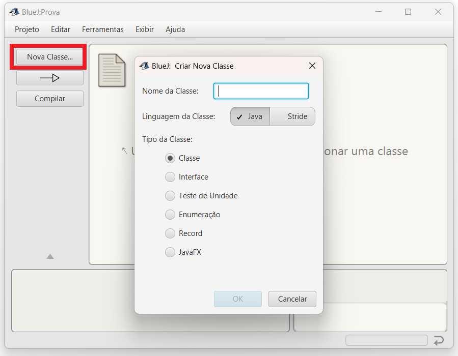
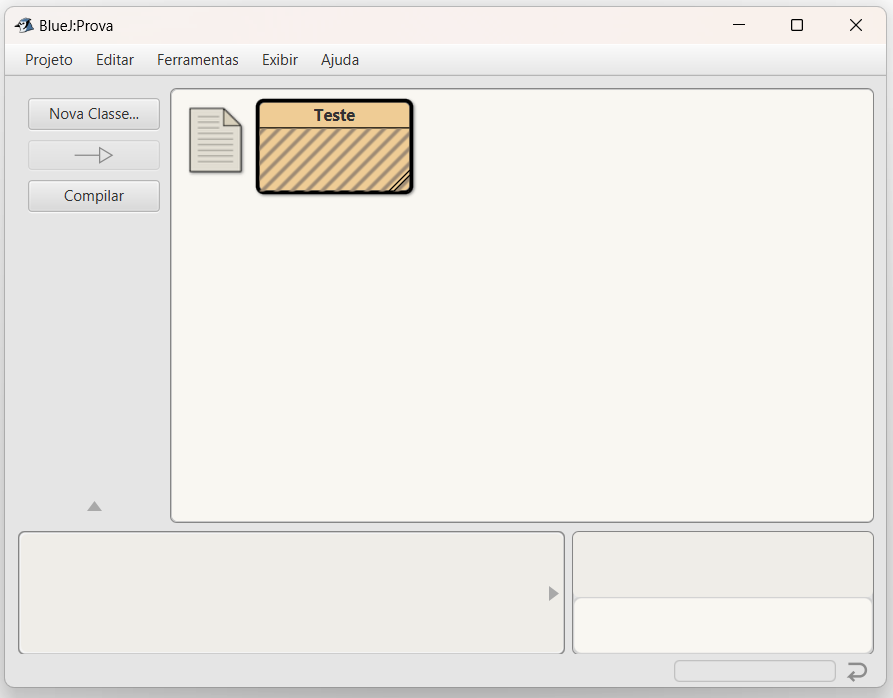
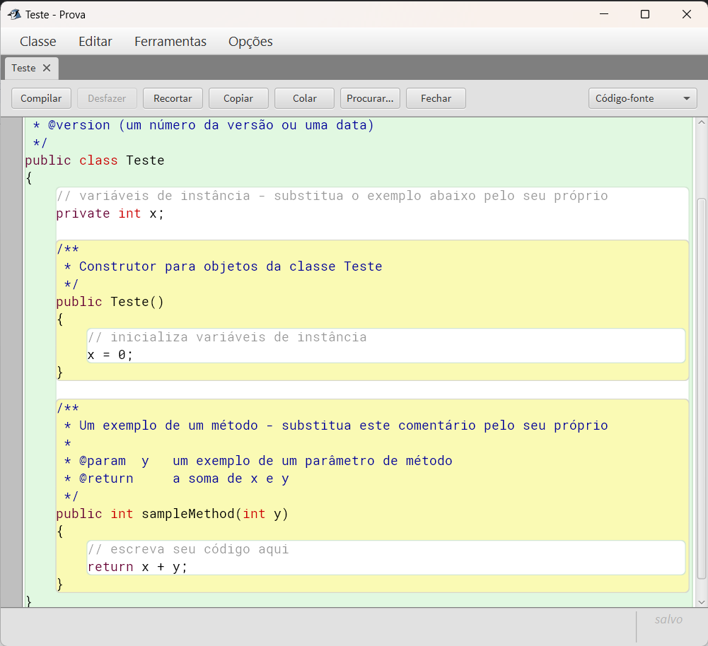

## Sobre as Aulas Práticas

::: {.nonincremental}

Relembrando:

- **Aulas práticas são importantes** para o entendimento dos conceitos.
- Mas, para isso, é fundamental que tenha **estudado o conteúdo teórico antes** da aula prática.
- Lembre-se que para **ter presença na aula** prática é necessário **responder à chamada**,
  e, [também]{.alert}, **entregar, no mínimo, 30% do exercícios** propostos até o final da aula.

:::

# Parte 1: Exercício Livro {background-color="#40666e"} 

##

Baixe o **projeto [exercicio-livro](https://github.com/ufla-ipoo/exercicio-livro)**.

- Avalie o código da classe `Livro` antes de começar os exercícios.
- Veja que ela tem apenas o rascunho inicial da classe, com dois atributos e um construtor.
- Nos exercícios vamos completá-la.

## Dica

Alguns exercícios a seguir pedem que você faça métodos:

- de acesso
- ou que exibem informações no terminal.

## Dica

Lembre-se que **métodos de acesso**:

- retornam informações para fora do objeto (portanto, têm comando `return`).
- E, na disciplina, usamos a convenção de começar o nome desses métodos com a palavra `obter`.

. . .

Já **métodos que exibem informação no terminal**:

- geralmente não retornam informação.
- E, na disciplina, usamos a convenção de começar o nome desses métodos com a palavra `imprimir`.


##

::: {.callout-note title="Exercício 1.1" icon=false}
Adicione à classe `Livro` dois métodos, `imprimirAutor` e `imprimirTitulo`, que exibem no terminal os valores de seus atributos correspondentes.
:::

. . .

::: {.callout-note title="Exercício 1.2" icon=false}
Adicione um atributo `paginas` à classe `Livro` para guardar a quantidade de páginas do livro.
O atributo deve ser do tipo `int` e seu valor inicial deve ser passado para o construtor junto com o `autor` e o `titulo`.
Adicione também um método de acesso `obterPaginas` para esse atributo.
:::

. . .

::: {.callout-note title="Exercício 1.3" icon=false}
Considerando a classe como ela está aagora, os objetos `Livro` são imutáveis?
Escreva sua resposta no comentário da classe (que aparece antes da declaração da classe).
:::

##

::: {.callout-note title="Exercício 1.4" icon=false}
Adicione um método `imprimirDetalhes` à classe Livro, que imprime no terminal o autor, o título e o número de páginas.
Escolha como você quer que a informação apareça na tela (poderia ser tudo em uma linha, ou uma informação por linha, por exemplo).
Pode ser útil explicar para o usuário o que é cada informação.
Exemplo:

::: {.halfincfontsize}
```
Livro de título: A Dança dos Dragões, escrito por: George R. R. Martin (864 páginas)
```
:::
:::

##

::: {.callout-note title="Exercício 1.5" icon=false}
Vamos agora adicionar um atributo para representar o número de chamada do livro, que é o identificador usado na biblioteca quando queremos buscar um livro.
O livro da disciplina, por exemplo, tem o número de chamada `005.133 BAR pro`.

Crie então um atributo para guardar essa informação (note que ele precisa ser do tipo `String`).
O atributo deve ser inicializado com string vazia (`""`) no construtor.
Crie um método modificador para o número de chamada, de forma que o usuário consiga defini-lo depois que o objeto estiver criado.
Crie também um método de acesso para que o usuário consiga consultar o valor definido.

**Dica**: não coloque espaço entre as aspas da string vazia, caso contrário, não será uma string vazia. 😉 
:::

##

::: {.callout-note title="Exercício 1.6" icon=false}
Modifique o método `imprimirDetalhes` para incluir o número de chamada do livro.
Caso o livro ainda não tenha um número de chamada definido, o método deve exibir a informação `NDEF` (de "não definido").

Você **deve** usar um comando condicional e o método `length` da classe String para saber se o número de chamada já foi definido ou não.

[Atenção]{.alert}: não faça comparações de strings usando operadores `==` ou `!=`. 
Como veremos mais adiante, comparar strings em Java dessa forma nem sempre funciona!
:::

. . .

::: {.callout-note title="Exercício 1.7" icon=false}
Altere o método que define o número de chamada de forma que ele só aceite números de chamada que tenham pelo menos três caracteres.
Caso o valor passado tenha menos que três caracteres, uma mensagem de erro deve ser exibida e o número de chamada não deve ser alterado.
:::

##

::: {.nonincremental}
::: {.callout-note title="Exercício 1.8" icon=false}
Por fim, vamos alterar a classe `Livro` para que seja possível contabilizar quantas vezes o livro já foi emprestado.

- Crie um atributo `numeroEmprestimos` do tipo `int` para guardar a quantidade de vezes que o livro foi emprestado.
- Crie um método `emprestar` que adiciona 1 ao atributo.
- Crie um método de acesso que permita consultar o número de empréstimos.
- Altere o método `imprimirDetalhes` para incluir a informação do atributo criado.
:::
:::

## 

::: {.callout-important title="Entrega no Campus Virtual"}
Acesse, no Campus Virtual, a atividade correspondente a essa parte dos exercícios e envie o código do projeto `exercicio-livro` da forma que ficou após as suas alterações (compacte a pasta em um arquivo `.zip` para enviar).
:::

# Parte 2: Exercício Aqueceder - Criando projeto do Zero {background-color="#40666e"}

##  

Agora, na segunda parte, vamos criar um novo projeto do zero no BlueJ.

. . .

Todos os exercícios que vocês fizeram até agora no BlueJ utilizaram projetos já criados.

- Neste exercício vamos aprender como criar um novo projeto e uma nova classe no BlueJ.
- Vejam como fazer isso nas instruções dos slides a seguir.

## 

Acesse o menu **Projeto** &rarr; **Novo Projeto**.

{.r-stretch}

## 

Aparecerá uma caixa de diálogo na qual você informará o **nome do projeto**.

- Você pode também mudar a pasta onde o projeto será colocado.
  - Será criada uma subpasta dentro dela com o nome que escolheu para o projeto.
- O projeto será criado, a princípio, sem nenhuma classe.



## 

Clique no botão **Nova Classe...**.

- Na caixa diálogo que aparece digite um **nome para a classe** e clique em OK.

{.r-stretch}

## 

A nova classe aparecerá no diagrama do BlueJ.

- Na imagem abaixo, por exemplo, foi criada uma classe de nome Teste.

{.r-stretch}

## 

Clique duas vezes na classe no diagrama para abrir o código-fonte.

- Veja que a classe é criada com um código inicial de exemplo.
- Apague e/ou altere o código de acordo com que precisar implementar na sua classe.

{.r-stretch}

## Resumo  

- Acesse o menu **Projeto** &rarr; **Novo Projeto**.
  - Dê um nome para o projeto.
- Clique no botão **Nova Classe...**.
  - Digite um nome para a classe e clique em OK.
- Clique duas vezes na classe no diagrama para abrir o código-fonte.
  - Apague e/ou altere o código gerado para a classe de acordo com que precisar implementar na sua classe.

##

::: {.callout-note title="Exercício 2.1" icon=false .nonincremental}
Crie um novo projeto chamado `exercicio-aquecedor` dentro do BlueJ.

- Crie uma classe chamada `Aquecedor` que contenha um único atributo, chamado `temperatura`, cujo tipo é `double` (_ponto flutuante de precisão dupla_).
- Implemente um construtor que não aceite parâmetros.
- O campo `temperatura` deve ser definido com o valor `20.0` no construtor.
- Implemente os métodos modificadores `esquentar` e `esfriar`, cujo efeito é aumentar ou diminuir o valor da temperatura em `3.0` graus, respectivamente.
- Defina um método de acesso para retornar o valor da temperatura.

Teste a classe criando alguns objetos e chamando seus métodos.
:::

##

::: {.callout-note title="Exercício 2.2" icon=false .nonincremental}
Modifique sua classe `Aquecedor` para definir três novos atributos de ponto flutuante de precisão dupla: `min`, `max` e `incremento`. 

- Os valores de `min` e `max` devem ser definidos por parâmetros passados ​​ao construtor.
- Já o valor de `incremento` deve ser definido como `3.0` no construtor.
- Modifique a implementação dos métodos `esquentar` e `esfriar` para que usem o valor de `incremento` em vez de um valor explícito de `3.0`. 

Antes de prosseguir para o próximo exercício, verifique se tudo funciona como antes.
:::

##

::: {.callout-note title="Exercício 2.3" icon=false .nonincremental}
Agora modifique o método `esquentar` para que ele não permita que a temperatura seja definida para um valor maior que `max`. 

- Da mesma forma, modifique o método `esfriar` para que ele não permita que a temperatura seja definida para um valor menor que `min`. 

Verifique se a classe funciona corretamente. 
:::

##

::: {.callout-note title="Exercício 2.4" icon=false .nonincremental}
Agora adicione um método chamado `mudarIncremento`, que espera um único parâmetro do tipo apropriado e o usa para definir o valor de `incremento`. 

Mais uma vez, teste se a classe funciona como você esperaria criando alguns objetos `Aquecedor` dentro do BlueJ e chamando seus métodos. 

As coisas ainda funcionam como esperado se um valor negativo for passado para o método `mudarIncremento`?

- Adicione uma verificação a este método para evitar que um valor negativo seja atribuído ao `incremento`.
:::

## 

::: {.callout-important title="Entrega no Campus Virtual"}
Acesse, no Campus Virtual, a atividade correspondente a essa parte dos exercícios e envie o código do seu projeto `exercicio-aquecedor` (compacte a pasta em um arquivo `.zip` para enviar).
:::
