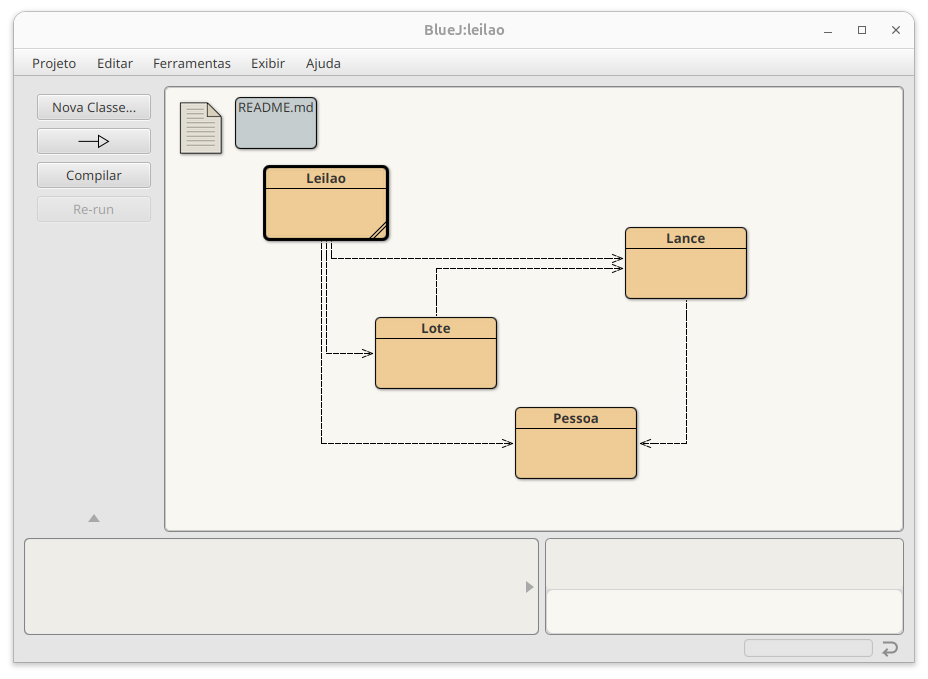
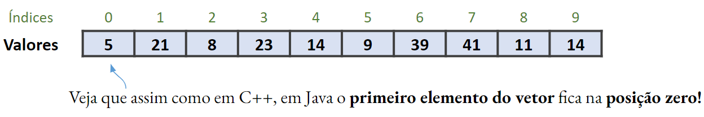

##

Este material é baseado no livro-texto da disciplina:

.

. . .

Dessa vez não vou colocar os lembretes antes de começar a aula.

- A essa altura você já sabe né? Não preciso repetir.

# Melhorando a estrutura: a classe `Musica` {background-color="#40666e"}

##

Como vimos na aula passada, **usar String para representar as músicas não é o ideal**.

- Qualquer tocador de música comercial permite, por exemplo, buscar por título, artista, álbum, gênero, etc.
  - Além de ter informações adicionais como a duração da música, por ex..

. . .

Um dos poderes da Orientação a Objetos é justamente permitir que **entidades do mundo real possam ser representadas como objetos** em nossos programas.

##

Como já sabemos como criar classes, com construtores, atributos e métodos,

- podemos **criar uma classe `Musica`** que represente as músicas.

. . .

Mas repare que, se quisermos ter todos os atributos mencionados para cada música (artista, título, gênero, álbum, etc.), 

- precisaríamos pedir ao usuário para fornecer todas essas informações.

##

Para evitar esse trabalho, vamos ilustrar essa questão com um **exemplo bem simples**.

- Vamos aproveitar o fato de que os arquivos de música fornecidos têm o nome do artista e da música no nome,
  - e usar uma classe auxiliar, chamada `LeitorDeMusica`,
  - que vai procurar todas as músicas .mp3 que estão em uma pasta, e usar os nomes dos arquivos para criar objetos da classe `Musica`.

##

O projeto [organizador-musicas-v5](https://github.com/ufla-ipoo/organizador-musicas-v5) tem a implementação proposta, com a classe `Musica`.

- Obs.: não vamos avaliar a classe `LeitorDeMusica` pois ela usa conceitos que ainda não vimos.

. . .

**Leia o código da classe `OrganizadorDeMusica`**. 

- Quais são as principais alterações?

##

Você deve ter notado que as principais alterações são:

- A classe `OrganizadorDeMusicas` tem agora um `ArrayList` de objetos `Musica` em vez de um `ArrayList` de `String`.
- Isso afeta diversos métodos que tínhamos implementado.

##

No método `listarTodasAsMusicas`, pedimos ao objeto `Musica` que retorne uma String contendo seus detalhes.

- Isso indica que estamos deixando a classe `Musica` responsável por fornecer os detalhes a serem exibidos, como o título e o artista.
- Este é um exemplo de **design baseado em responsabilidade** que veremos em mais detalhes no Cap. 7.

. . .

No método `tocarMusica`, precisamos agora obter o nome do arquivo do objeto `Musica` para passá-lo para o tocador.

. . .

Foram adicionados também códigos para buscar todas as músicas que estão na pasta principal do projeto.

##

Repare que ao utilizarmos a classe `Musica` alguns métodos ficaram um pouco mais complicados.

- Mas a estrutura do programa é agora muito melhor.
- A classe `Musica` é mais bem estruturada que uma simples String 
  - e ainda nos permitiria guardar informações mais interessantes, como, por exemplo, uma imagem do artista ou do álbum de música, por exemplo.

##

Além disso, agora conseguimos evitar o problema mencionado na aula anterior,

- De querermos buscar todas as músicas que tenham a palavra `renda` no título,
- mas isso acabar retornando músicas de uma cantora chamada `Brenda`.

. . .

No método apresentado a seguir esse problema é resolvido 

- usando o fato de que a classe `Musica` tem a informação do título separada do nome do arquivo.

##

::: {.halfincfontsize}
```{.java code-line-numbers="false"}
/**
 * Lista todas as músicas que tenham uma string passada 
 * em seu título
 * @param stringDeBusca A string a ser procurada.
 */
public void buscarNoTitulo(String stringDeBusca)
{
    for (Musica musica : musicas) {
        String titulo = musica.obterTitulo();
        if (titulo.contains(stringDeBusca)) {
            System.out.println(musica.obterDetalhes());
        }
    }
}
```
:::

## 

::: {.callout-note title="Exercício 1" icon=false}
Adicione um atributo `numeroDeExecucoes` à classe `Musica`.
Implemente métodos para reiniciar a contagem (voltando para zero) e para incrementá-la em um.
Altere também o método `obterDetalhes` para que inclua essa informação.

Em seguida, altere a classe `OrganizadorDeMusicas` de forma que toda vez que uma música for tocada, seja contabilizada mais uma execução dela.
:::

. . .

::: {.callout-note title="Exercício 2" icon=false}
Você deve ter notado que se você tocar duas músicas sem parar a primeira, elas ficam tocando simultaneamente.
E, claro, isso não é muito útil.
Implemente as alterações necessárias para que uma música pare de tocar automaticamente quando uma outra música começa a tocar.
:::

# O tipo `Iterator` {background-color="#40666e"}

##

Existe uma **terceira forma de iterar sobre uma coleção** que é uma espécie de um meio-termo entre **for-each** e `while`.

- Ela usa um loop `while`, mas com um [objeto iterador]{.alert} em vez de uma variável inteira índice para guardar a posição na lista.

. . .

Nós usamos uma classe `Iterator` e um método `iterator`.

- Repare a diferença pela letra `i` maiúscula e minúscula, respectivamente.

## 

A classe `ArrayList` tem um método `iterator` que retorna um objeto `Iterator`.

- Para usar a classe, precisamos importá-la do pacote `java.util`.

. . .

::: {.halfincfontsize}
```{.java code-line-numbers="false"}
import java.util.ArrayList;
import java.util.Iterator;
```
:::

##

Um iterador tem apenas quatro métodos, e usamos dois deles para iterar sobre uma coleção.

- O **método `hasNext`** (*temProximo*) indica se há mais elementos na coleção.
- E **o método `next`** (*proximo*) retorna o próximo elemento.

##

O pseudocódigo abaixo mostra como geralmente utilizamos iteradores para percorrer uma coleção

::: {.halfincfontsize}
```{.java code-line-numbers="false"}
  // Obtemos o iterador da coleção
  // - Como Iterator é uma classe genérica, precisamos 
  //   informar um segundo tipo (que é o tipo dos 
  //   elementos da coleção)
  Iterator<TipoDoElemento> it = minhaColecao.iterator();
  // Enquanto há elementos a processar
  while (it.hasNext()) {      
      // Chamamos it.next() para obter o próximo elemento
      // Fazemos alguma coisa com o elemento
  }
```
:::

## {auto-animate=true}

Podemos fazer então uma terceira versão do método que lista todas as músicas, agora usando um `Iterator`.

. . .

::: {.halfincfontsize}
```{.java code-line-numbers="false"}
  public void listarTodasAsMusicas() {
      Iterator<Musica> it = musicas.iterator();
      while (it.hasNext()) {
          Musica musica = it.next();
          System.out.println(musica.obterDetalhes());
      }
  }
```
::: 

. . .

Quais são as diferenças para as versões anteriores do método `listarTodosOsArquivos`?

## {auto-animate=true}

Quais são as diferenças para as versões anteriores do método `listarTodosOsArquivos`?

- Nós usamos um loop `while`, mas não precisamos nos preocupar com uma variável de índice.
- Repare que o principal ponto a entender é que o método `next`, além de retornar o próximo elemento, passa o iterador para frente.
- Portanto, chamadas sucessivas do método `next` retornam sempre elementos diferentes.
  - Mas cuidado, se terminarem os elementos, e o método `next` for chamado sem antes verificar se `hasNext` retorna `true`, ocorrerá um erro no programa.

##

::: {.callout-tip title="Conceito" icon=false}
Um **iterador** é um objeto que permite iterar sobre todos os elementos de uma coleção.
:::

. . .


##

Realmente, o que fizemos até agora não traz vantagens. 

- Mas há duas situações nas quais um `Iterator` é muito útil:

1. Para coleções cujo acesso por posição não é possível, ou muito lento.
2. Para a remoção de vários elementos de uma coleção.

## Acesso por índice vs. iteradores

. . .

Quando estamos usando um `ArrayList`, não faz nenhuma diferença utilizar `while` acessando por índice ou com iteradores.

- Mas nem toda coleção funciona assim.
- Veremos coleções mais adiante que não permitem acesso por posição.
  - Ou esse acesso seria muito lento.
  - E, portanto, seria inviável utilizar `while` acessando por índice.

## Acesso por índice vs. iteradores

A solução de **utilizar `while` com um `Iterator` funciona para todas as coleções da biblioteca** de classes do Java.

- E, portanto, é um **padrão de código** que usaremos novamente mais adiante.

# Removendo elementos de uma coleção {background-color="#40666e"}

## {auto-animate=true}

Remover elementos traz consequências importantes quando estamos iterando uma coleção.

- Suponha, por exemplo, que não estamos mais interessados em um artista e queremos remover todas as suas músicas.
- Pode parecer bem simples implementar um método para isso, seguindo pseudocódigo abaixo.

. . .

  ```{.java code-line-numbers="false"}
  para cada música na colecao {
      se musica.obterArtista() é o artista que não queremos mais {
          colecao.remove(musica);
      }
  }
  ```

. . .

Apesar dessa forma parecer perfeitamente razoável, não é possível remover elementos usando um loop **for-each**.

## {auto-animate=true}

  ```{.java code-line-numbers="false"}
  para cada música na colecao {
      se musica.obterArtista() é o artista que não queremos mais {
          colecao.remove(musica);
      }
  }
  ```

Apesar dessa forma parecer perfeitamente razoável, não é possível remover elementos usando um loop **for-each**.

- Se você tentar fazer isso, ocorrerá um erro no programa (`ConcurrentModificationException`).
- Isso ocorre porque a remoção causa uma confusão sobre qual seria o próximo elemento nesta situação.

##

A solução para usar isso é **usar um `Iterator` para remover elementos** de uma coleção.

- Além dos métodos `hasNext` e `next`, a classe tem um método `remove`.
- O método remove o elemento que foi retornado pela última chamada do método `next`.

##

O trecho de código abaixo mostra como remover as músicas de um artista da coleção de músicas.

- Repare que **chamamos o método `remove` do iterador** e [não]{.alert} do `ArrayList`.

::: {.halfincfontsize}
```{.java code-line-numbers="false"}
  Iterator<Musica> it = musicas.iterator();
  while (it.hasNext()) {
      Musica musica = it.next();
      String artista = musica.obterArtista();
      if (artista.equals(artistaARemover)) {
          it.remove();
      }
  }
```
:::

##

Há outras formas de remover elementos de uma coleção.

- Por ex.: fazer um loop para encontrar a posição de um elemento.
- E depois do loop remover o elemento daquela posição.

. . .

Mas veja que há desvantagens:

- Como já mencionamos, nem toda coleção permite acessar elementos por posição, ou esse acesso é lento.
- Além disso, com iterador podemos fazer a remoção já dentro do loop, sem precisar fazer uma operação separada.

##

Portanto, é uma boa ideia saber como remover elementos de uma coleção usando um objeto `Iterator`. :)

. . .

::: {.callout-note title="Exercício 3" icon=false}
Implemente um método na classe `OrganizadorDeMusicas` que receba uma string por parâmetro e remova todas as músicas cujos títulos tenham aquela string.
:::

# Um Sistema de Leilão {background-color="#40666e"}

##

Vamos dar continuidade aos novos conceitos que vimos neste capítulo em um contexto diferente.

. . .

O projeto [leilao](https://github.com/ufla-ipoo/leilao) modela parte da operação de um **sistema de leilão online**.

## 

Um leilão consiste de um conjunto de itens oferecidos para venda.

- Esses itens são chamados de "lotes" e cada um tem um número único.
- Uma pesssoa pode tentar comprar um lote dando um lance por ele.
- A ideia é que o leilão tenha um limite de tempo (não implementado).
- No final desse tempo, o lote é vendido para a pessoa que deu o maior lance.
- Lotes sem nenhum lance continuam disponíveis para próximos leilões.

##

O projeto possui as classes: `Leilao`, `Lance`, `Lote` e `Pessoa`.

- O diagrama de classes do BlueJ mostra que os relacionamentos entre as classes é um pouco mais complicado do que os exemplos que vimos até agora.



##

Vemos que objetos `Leilao` se relacionam com objetos das outras três classes.

- Objetos `Lote` relacionam com objetos `Lance`.
- E objetos `Lance` com objetos `Pessoa`.

. . .

Mas para saber quais informações os objetos acessam, precisaremos verificar o código-fonte.

##

Vamos avaliar o código do projeto.

- Você verá coisas familiares, como o uso de `ArrayList` e loops.
- E também várias coisas que você pode não entender a princípio,
  - mas que são esperadas, já que a ideia é ver novas ideias e novas formas de fazer as coisas.

##

Um objeto `Leillao` é o ponto de partida para o projeto.

- Quem quer vender itens os inserem no leilão através do método `cadastrarLote`, 
  - mas fornecem apenas uma descrição (string).
- O objeto `Leilao` cria então um objeto `Lote` cada cada lote cadastrado.

. . .

Isso modela o funcionamento de um leilão no mundo real.

- Não é quem vende o item que define o código de identificação do lote.

##

Para dar lances, as pessoas devem se cadastrar na casa de leilões. 

- Para isso, devemos primeiro criar objetos `Pessoa`.
  - que tem apenas um nome no nosso projeto.
- Quando alguém deseja dar um lance em um lote, deve chamar o método `darUmLance` do objeto `Leilao`, inserindo:
  - o número do lote de seu interesse (e não o objeto lote!)
  - o objeto `Pessoa` do comprador
  - e o valor do lance.

##

Os objetos `Lote` permanecem internos ao objeto `Leilao` 

- e são sempre referenciados externamente pelo seu número de lote.

##

O objeto `Leilao` transforma um valor monetário de lance em um objeto `Lance`

- que registra o valor e a pessoa que ofereceu esse valor. 
- É por isso que vemos uma ligação da classe `Lance` para a classe `Pessoa` no diagrama de classes.

. . .

No entanto, observe que não há ligação de `Lance` para `Lote`

- a ligação é o inverso, porque um `Lote` registra qual é o lance mais alto atual para esse lote. 
- Isso significa que o objeto `Lote` substituirá o objeto `Lance` que ele armazena cada vez que um lance mais alto for feito.


##

O que descrevemos aqui revela uma cadeia bastante aninhada de referências de objetos. 

- Objetos `Leilao` armazenam objetos `Lote`; 
- cada objeto `Lote` pode armazenar um objeto `Lance`; 
- cada objeto `Lance` armazena um objeto `Pessoa`. 

. . .

Essas cadeias são muito comuns em programas, 

- portanto, este projeto oferece uma boa oportunidade para explorar como elas funcionam na prática.

##

::: {.callout-note title="Exercício 4" icon=false}
Crie um leilão com alguns lotes, pessoas e lances.
Em seguida use o inspetor de objetos para investigar suas estruturas.
Comece com o objeto leilão, e continue inspencionado a partir das referências que encontrar nos atributos dos objetos.
:::

. . .

Vamos focar nossa atenção aqui nas classes `Leilao` e `Lote`.

- Fica para casa o estudo das classes `Pessoa` e `Lance`

## A palavra-chave `null`

Vimos que um objeto `Lance` só é criado quando alguém realmente dá um `lance` no leilão.

- E o construtor da classe `Lance` recebe a pessoa que fez o leilão
- podendo assim inicializar seu atributo que referencia a pessoa que fez o lance.

##

Já um objeto `Lote` é criado quando ele é cadastrado no leilão
 
- e, claro, não tem nenhum lance ainda.

. . .

Mesmo assim ele tem um atributo `Lance` para guardar o maior lance dado pelo lote.

- Com que valor esse atributo deveria ser inicializado no construtor?
- Precisamos de um valor que indique que "nenhum objeto" é referenciado pela variável.
  - Em certo sentido, indicando que a variável está "vazia".
- Em Java, indicamos isso com a [palavra-chave `null`]{.alert}.

##

Portanto, inicializamos o atributo com o comando:

::: {.halfincfontsize}
```{.java code-line-numbers="false"}
  maiorLance = null;
```
:::

. . .

Um princípio **muito importante** é que, se uma variável tem valor `null`,

- ela não pode ser usada para chamar métodos.

##

Isso acontece porque métodos pertencem a objetos.

- E se a variável não referencia nenhum objeto, não há como chamar métodos.

. . .

Por isso, é muito comum (e recomendado), usar comandos `if` para verificar se uma variável tem valor `null`

- antes de fazer uma chamada de método.

. . .

Sem isso, nosso programa pode gerar um erro de execução muito comum:

- chamado `NullPointerException`.

## 

Muitas vezes, erros de `NullPointerException` ocorrem por falha na inicialização de atributos.

- Por algum erro de implementação.

. . .

Mas não é o caso do projeto `leilao`.

- Pois aqui, faz realmente sentido que um lote ainda não tenha um lance ao ser criado.

##

::: {.callout-tip title="Conceito" icon=false}
A palavra reserva **null** do Java é usada para significar "nenhum objeto" quando uma variável não está referenciando nenhum objeto específico. Um atributo de tipo objeto que não tenha sido inicializado explicitamente tem o valor `null` por padrão.
:::


## A classe `Lote`

. . .

A classe lote armazena a descrição do lote, um número e o lance mais alto.

. . .

O método `receberLance` trata o que acontece quando alguém dá um lante no lote.

- Ele precisa verificar se o lance é válido ou não.
- Ele é válido se for o maior lance dado até o momento.
- Veja a implementação a seguir e repare na verificação feita usando a palavra-chave `null`.
  - Se o maior lance é `null`, esse é o primeiro lance e, portanto, o maior até agora.

## 

::: {.halfincfontsize}
```{.java code-line-numbers="false"}
  .... 
```
:::

## A classe `Leilao`

A classe `Leilao` ilustra o uso de `ArrayList` e loop usando _for-each_.

- Abra e avalie o código da classe.

. . .

Veja que o atributo `lotes` é um `ArrayList` usado para guardar os lotes oferecidos no leilão.

- Ele são cadastrados através de uma descrição simples passada para o método `cadastrarLote`
- Um novo lote é criado passando a descrição e um número de lote único para o construtor.
- O novo lote é adicionado à coleção.

## {auto-animate=true}

Veremos agora uma característica comum em programas OO ilustrados pela classe `Leilao`.

. . .

O método `cadastrarLote` ilustra o uso de [objetos anônimos]{.alert}:

::: {.halfincfontsize}
```{.java code-line-numbers="false"}
  lotes.add(new Lote(proximoNumeroDeLote, descricao));
```
:::

## {auto-animate=true}

::: {.halfincfontsize}
```{.java code-line-numbers="false"}
  lotes.add(new Lote(proximoNumeroDeLote, descricao));
```
:::

Aqui estamos fazendo duas coisas:

- criando um novo objeto `Lote`.
- E também passamos este novo objeto para o método `add` do `ArrayList`.

##

Nós poderíamos ter feito o código separando as duas coisas:

::: {.halfincfontsize}
```{.java code-line-numbers="false"}
  Lote novoLote = new Lote(proximoNumeroDeLote, descricao);
  lotes.add(novoLote);
```
:::

. . .

As duas versões são equivalentes:

- Mas se não usamos a variável `novoLote` para mais nada,
- a versao original tem a vantagem de evitar a declaração de uma variável de uso limitado.
  - Chamamos de objeto anônimo (sem nome) pois é passado diretamente para o método.

##

::: {.callout-note title="Exercício 5" icon=false}
O método `darUmLance` inclui as duas instruções a seguir:

::: {.halfincfontsize}
```{.java code-line-numbers="false"}
  Lance lance = new Lance(ofertante, value);
  boolean lanceDeuCerto = loteSelecionado.receberLance(lance);
```
:::

A variável `lance` é usada aqui apenas como um espaço reservado para o objeto `Lance` recém-criado, antes de ser passado imediatamente para o método `receberLance` do lote. 

Reescreva essas instruções para eliminar a variável `lance` usando um objeto anônimo, como visto no método `cadastrarLote`.
:::

## Encadeamento de chamadas

. . .

Da forma como o projeto está implementado,

- Como um objeto `Leilao` poderia identificar quem tem, no momento, o lance mais alto para um lote?

. . .

Ele precisará solicitar ao `Lote` que retorne o objeto `Lance` para esse lote, 

- em seguida, solicitar ao objeto `Lance` a `Pessoa` que fez o lance e, 
- por fim, solicitar ao objeto `Pessoa` o seu nome.

##

Ignorando a possibilidade de referências de objetos `null`, 

- isso poderia ser feito com a seguinte sequência de chamadas.

. . .

::: {.halfincfontsize}
```{.java code-line-numbers="false"}
Lance lance = lote.obterLanceMaisAlto();
Pessoa ofertante = lance.obterOfertante();
String nome = ofertante.obterNome();
System.out.println(nome);
```
:::

##

Como as variáveis `lance`, `ofertante` e `nome` estão sendo usadas 

- simplesmente como estágios intermediários para chegar ao nome do ofertante,
- é comum ver sequências como esta compactadas por meio do uso de referências a objetos anônimos. 

. . .

Por exemplo, podemos obter o mesmo efeito com o seguinte:

```{.java code-line-numbers="false"}
System.out.println(lote.obterLanceMaisAlto().obterOfertante().obterNome());
```

##

```{.java code-line-numbers="false"}
System.out.println(lote.obterLanceMaisAlto().obterOfertante().obterNome());
```

Pode dar a impressão que um método está chamando outro método, mas não é assim que deve ser lido. 

- A chamada para `obterLanceMaisAlto` retorna um objeto `Lance` anônimo, 
  - e o método `obterOfertante` é então chamado nesse objeto. 
- Da mesma forma, `obterOfertante` retorna um objeto `Pessoa` anônimo,
  - então `obterNome` é chamado nessa pessoa.

##

Essas cadeias de chamadas de métodos podem parecer complicadas, 

- mas podem ser desvendadas se você entender as regras envolvidas. 

. . .

Mesmo que você opte por não escrever seu código dessa maneira mais concisa, 

- é importante que você aprenda a ler códigos assim, 
- porque você pode se deparar com ele no código criado por outro programador.

##

::: {.callout-note title="Exercício 6" icon=false}
Adicione um método `fechar` à classe `Leilao`. 
Este método deve iterar sobre a coleção de lotes e imprimir os detalhes de todos os lotes. 
Use um loop _for-each_. 
Qualquer lote que tenha recebido pelo menos um lance é considerado vendido, portanto, o que você está procurando são objetos `Lote` cujo atributo `lanceMaisAlto` não seja `null`. 
Use uma variável local dentro do loop para armazenar o valor retornado das
chamadas ao método `obterLanceMaisAlto` e, em seguida, teste essa variável para verificar se o valor é `null`.

Para lotes com um ofertante, os detalhes devem incluir o nome de quem arrematou
e o valor do lance vencedor. Para lotes sem ofertantes, imprima um texto que indique isso.
:::

##

::: {.callout-note title="Exercício 7" icon=false}
Adicione um método `obterNaoVendidos` à classe `Leilao` com o
seguinte cabeçalho:

::: {.halfincfontsize}
```{.java code-line-numbers="false"}
public ArrayList<Lote> obterNaoVendidos()
```
:::

Este método deve iterar sobre o atributo `lotes`, armazenando os lotes não vendidos em uma nova variável local `ArrayList`. O que você está procurando são objetos `Lote` cujo campo `lanceMaisAlto` seja `null`. Ao final do método, retorne a lista de lotes não vendidos.
:::

##

::: {.callout-note title="Exercício 8" icon=false}
Suponha que a classe `Leilao` tivesse um método que permitisse remover um lote do leilão. Assumindo que os lotes restantes não tenham seus atributos `numeroDoLote` alterados quando um lote for removido, escreva qual
você acha que seria o impacto no método `obterLote`.
:::

##

::: {.callout-note title="Exercício 9" icon=false}
Reescreva o método `obterLote` de forma que ele não dependa de um lote com um determinado número estar armazenado no índice (número–1) na coleção. Por exemplo, se o lote número 2 tiver sido removido, o lote número 3 terá sido movido do índice 2 para o índice 1, e todos os lotes de números superiores também terão sido movidos uma posição no índice. Você pode assumir que os lotes são sempre armazenados em ordem crescente de acordo com seus números de lote.
:::

##

::: {.callout-note title="Exercício 10" icon=false}
Adicione um método `removerLote` à classe `Leilao`, com o seguinte cabeçalho:

::: {.halfincfontsize}
```{.java code-line-numbers="false"}
/**
* Remove o lote com o número fornecido.
* @param number O número do lote a ser removido.
* @return O lote com o número fornecido, ou `null` se
* não houver tal lote.
*/ public Lote removerLote(int numero)
```
:::

Este método não deve pressupor que um lote com um determinado número esteja armazenado em qualquer local específico dentro da coleção.
:::


# Coleções de tamanho fixo {background-color="#40666e"}

##

Apesar de coleções de tamanho flexível serem úteis na maioria dos casos,

- Há situações nas quais sabemos quantos elementos uma coleção terá durante todo o tempo de execução de um programa.
- Nesses casos, é melhor utilizar uma **coleção de tamanho fixo**: [um vetor]{.alert} (ou *array*).

##

Mas qual a **vantagem de usarmos vetores**?

- É que o acesso por índice (posição) é geralmente mais eficiente do que em uma coleção de tamanho flexível, como a `ArrayList`.
- Outra vantagem é que, em Java, podemos ter vetores de elementos que são tipos primitivos.
  - Enquanto `ArrayList`, por exemplo, permite guardar apenas objetos.
  - Apesar de que, como veremos no próximo capítulo, há uma forma de lidarmos com isso usando *wrappers* (classes empacotadoras).

##

Um **vetor** é um grupo de variáveis que contém **elementos de um mesmo tipo**.

- Em Java, vetores são considerados objetos, portanto, são considerados tipos por referência.
- Como já mencionado, os elementos de um vetor podem ser de tipos primitivos ou de tipos por referência (objetos).

. . .

Exemplo de um vetor:



##

Podemos **declarar um vetor** em Java, utilizando uma das seguintes formas:

::: {.halfincfontsize}
```{.java code-line-numbers="false"}
TipoDosElementos[] nomeDoVetor;
TipoDosElementos nomeDoVetor[];
```
:::

. . .

Exemplos:

::: {.halfincfontsize}
```{.java code-line-numbers="false"}
double[] notas;
int meuVetorDeInteiros[];
```
:::

. . . 

Recomendo usar a primeira opção por ter melhor legibilidade.

##

Como os demais objetos, os **vetores são criados** por meio da palavra-chave `new`:

::: {.halfincfontsize}
```{.java code-line-numbers="false"}
nomeDoVetor = new TipoDosElementos[capacidade];
```
:::

. . .

Exemplos:

::: {.halfincfontsize}
```{.java code-line-numbers="false"}
double[] notas;
notas = new double[3];

int meuVetorDeInteiros[];
meuVetorDeInteiros = new int[10];
```
:::

##

Há ainda outras duas formas alternativas de se instanciar um vetor.

. . .

::: {.halfincfontsize}
```{.java code-line-numbers="false"}
// Declara e instancia em uma única linha
int meuVetorDeInteiros[] = new int[10];

// Declara, instancia um vetor com 3 posições e 
// já inicializa os seus valores
double notas[] = {7.5, 8.0, 9.0};
```
:::

##

Em C++ um vetor criado, mas não inicializado, pode conter lixo de memória.

- Mas em Java, vale a regra de inicialização igual a dos atributos.
  - **Vetor de tipos numéricos** tem todos os elementos **inicializados com zero**.
  - **Vetor de booleanos** tem todos os elementos **inicializados com `false`**.
  - **Vetor de objetos** tem todos os elementos **inicializados com `null`**.

## O loop `for`

Geralmente utilizamos um [loop `for`]{.alert} para percorrer os elementos de um vetor.

- A **sintaxe** do loop `for` em Java é **igual à do C++**.
- Usamos o atributo `length`, que é constante e público, e retorna o tamanho do vetor.

. . .

::: {.halfincfontsize}
```{.java code-line-numbers="false"}
for(int i = 0; i < vetor.length; i++) {
    // Usando vetor[i], estamos acessando a 
    // posição i do vetor.
	vetor[i] = i;
}
```
:::

## O loop `for`

Como podemos então exibir todos os elementos de um vetor de inteiros chamado `vet`?

. . .

::: {.halfincfontsize}
```{.java code-line-numbers="false"}
for(int i = 0; i < vet.length; i++) {
	System.out.println(vet[i]);
}
```
:::

## Usando vetores em métodos

. . .

Podemos passar vetores como parâmetro de métodos. 

- A passagem é por referência, ou seja, estamos passando o ponteiro para o vetor.
- Portanto, se o método alterar o vetor, ele estará alterando o vetor original passado por parâmetro

. . .

::: {.halfincfontsize}
```{.java code-line-numbers="false"}
public void preencherVetor(int vet[]) {
	for (int i = 0; i < vet.length; i++) {
    	vet[i] = i;
	}
}
```
:::

## Usando vetores em métodos

Podemos também criar métodos que retornam vetores.

. . .

::: {.halfincfontsize}
```{.java code-line-numbers="false"}
public int[] criarVetor() {
	int v[] = new int[10];
	return v;
}
```
:::

## Vetores de objetos

Nós podemos também criar vetores para guardar objetos.

- Suponha, por exemplo, que queiramos poder criar e trabalhar com vários objetos de uma classe `Carro`.

. . .

::: {.halfincfontsize}
```{.java code-line-numbers="false"}
// Estamos declarando um vetor de carros, com 
// capacidade de guardar 10 objetos Carro
Carro[] carros = new Carro[10];

// Em cada posição do vetor, podemos colocar um
// objeto do tipo Carro
carros[0] = new Carro("Gol");
carros[1] = new Carro("Onix");
```
:::

## Vetores de objetos {auto-animate=true}

Nós podemos então acessar cada objeto `Carro` no vetor, a partir de sua posição.

. . .

::: {.halfincfontsize}
```{.java}
for(int i = 0; i < carros.length; i++) {
	if (carros[i] != null) {
        // Estamos exibindo nome do carro chamando
        // o método obterNome
	    System.out.println(carros[i].obterNome());
    }
}
```
:::

## Vetores de objetos {auto-animate=true}

::: {.halfincfontsize}
```{.java}
for(int i = 0; i < carros.length; i++) {
	if (carros[i] != null) {
        // Estamos exibindo nome do carro chamando
        // o método obterNome
	    System.out.println(carros[i].obterNome());
    }
}
```
:::

Repare que a condição (`if`) da linha 2 é muito importante:

- pois caso alguma posição do vetor não tenha sido inicializada, seu valor é `null`.
- E poderia então ocorrer um erro (`NullPointerException`) ao tentar chamar o método `obterNome`.


## Usando for-each com vetores

Nós também podemos usar um **loop *for-each*** para percorrer os elementos de um vetor.

. . .

::: {.halfincfontsize}
```{.java code-line-numbers="false"}
for(Carro carro : carros) {
	if (carro != null) {
        // Estamos exibindo nome do carro chamando 
        // o método obterNome
	    System.out.println(carro.obterNome());
    }
}
```
:::

## 

Este exemplo nos permite enfatizar uma das vantagens do loop *for-each*:

- Repare que esse código seria exatamente igual se a variável `carros` fosse um `ArrayList` em vez de um vetor.
- Já na opção anterior, usando loop for tradicional, os códigos seriam diferentes.
  - Primeiro porque consultamos o tamanho de um vetor usando o atributo `length` e de um `ArrayList` usando o método `size`.
  - E segundo que acessamos um elemento por posição em um vetor usando `[i]` e em um `ArrayList` usando `get(i)`.

## Vetores vs. ArrayList

Agora que conhecemos tanto **vetores** quanto `ArrayList`, qual deles devemos utilizar?

- É melhor usar `ArrayList` se o número de elementos pode ser alterado durante a execução do programa.
  - Ou se você não sabe, antes de criar a coleção, quantos elementos serão usados.
- Seria melhor usar um vetor quando o número de elementos é pré-determinado.
  - E a eficiência de acesso por posição é muito importante.

## Vetores vs. ArrayList

Na prática acabamos usando `ArrayList` em muitas situações mesmo quando temos uma quantidade fixa de elementos.

- Mas, de toda forma, precisamos saber utilizar vetores pois é comum precisarmos usar métodos de classes da biblioteca do Java (ou de terceiros) que trabalham com vetores.

