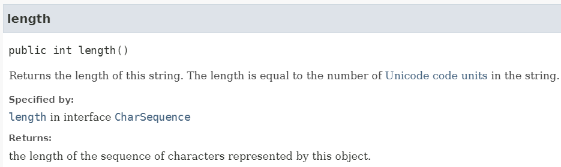

##

Os tópicos abaixo te lembram alguma coisa? :)

- **Praticar enquanto estuda**.
- **Ler o capítulo do livro**.
- **Anotar conceitos e dúvidas**.

. . .

{.r-stretch}


##

## Principais Conceitos do Capítulo

::: {.nonincremental}
- Encapsulamento
- Atributos e métodos estáticos
- Constantes
- Uso de classes de biblioteca
- Documentação de classes
:::

. . .

Construções Java do capítulo

::: {.nonincremental}
- `String`, `Random`, `static`, `final`,  autoboxing, classes empacotadoras.
:::

##


. . .

O conceito de **encapsulamento** é fundamental na Programação Orientada a Objetos.

- E será apresentado no final do capítulo.
- Não deixe de estudar esse conteúdo!!!

##

No capítulo anterior conhecemos a classe `ArrayList` da biblioteca de classes do Java.

- Com ela, ficou mais fácil fazer programas para guardar uma quantidade qualquer de objetos.
- O que sem ela seria bem mais complicado.

. . .

Mas ela é apenas um exemplo de classe da biblioteca.

- Existem muitas que serão muito úteis em nossos softwares.
- E outras que, possivelmente, nunca usaremos.

##

Um **bom programador** Java precisa **conseguir trabalhar com as classes da biblioteca**.

- E saber quando utilizar cada uma.
- De forma a tornar a implementação de um programa mais fácil.

. . .

Muitas classes da biblioteca têm certas características comuns entre si.

- Especialmente as coleções, são classes que compartilham muitos atributos.
- E, usando a abstração, podemos tratar de classes de coleções de uma maneira mais geral.

##

Neste capítulo, vamos trabalhar com um **sistema de Suporte Técnico**.

- Começaremos com uma versão rudimentar.
- E ele será melhorado, incrementalmente, utilizando diferentes classes da biblioteca Java.


# Documentação das classes de biblioteca {background-color="#40666e"}

##

A biblioteca de classes do Java tem centenas de classes, com muitas opções de métodos.

- Será que um bom programador precisa conhecer todas elas de cor?

. . .

Na verdade, um bom programador deveria:

- Conhecer **pelo nome as classes mais importantes e seus métodos** (`ArrayList` é uma delas).
- Saber **como encontrar informações das demais classes** (tais como métodos e parâmetros).

##

O livro da disciplina recomenda que um programador conheça a **documentação do Java** para essas classes.

- A documentação é formada por páginas HTML bem detalhadas sobre todas as classes da biblioteca.
- Mas para quem não é fluente em inglês, isso pode gerar uma barreira inicial.
  - Portanto, uma sugestão é usar também outras fontes para saber como usar as classes,
  - como buscas no Google ou ferramentas de IA, como ChatGPT ou Gemini.

##

De toda forma, à medida que você fique mais experiente, saber usar a documentação pode ser muito útil.

- Essa é uma das coisas que separam o programador juninho do bom programador.

##

Um ponto importante sobre o uso da classe `ArrayList` é que nós já a utilizamos sem nunca termos visto o código da classe.

- Nós não conferimos como ela foi implementada.
- E isso não foi necessário para utilizarmos suas funcionalidades.

. . .

Tudo o que precisamos saber é:

- O nome da classe.
- As assinaturas dos seus métodos (nomes, parâmetros e tipos de retorno).
- E o que exatamente esses métodos fazem.

##

A mesma coisa acontece em projetos de software grandes de uma empresa.

- Geralmente, várias pessoas trabalham em diferentes partes do sistema.
- Cada programador deveria se concentrar em sua parte, sem ter que entender detalhes das outras partes.
  - Como discutimos ao falar sobre *abstração* e *modularização*.

##

Cada programador deveria conseguir usar as classes das outras equipes como se elas fossem classes de biblioteca.

- Sabendo o que elas fazem, mas sem precisar saber como elas funcionam internamente.

. . .

Mas, para isso funcionar, cada membro de equipe deveria documentar sua classe assim como é feito para as classes da biblioteca

- Permitindo que outros programadores usem a classe sem precisar ler o código.
- Veremos como fazer isso mais adiante neste capítulo.


# O sistema de suporte técnico {background-color="#40666e"}

##

A ideia do **sistema de Suporte Técnico** é que ele seja um **chat de atendimento** aos clientes.

- de uma empresa fictícia, chamada *DesonestosSistemas*.

. . . 

Antigamente a empresa tinha funcionários que faziam atendimento por telefone.

- Mas ela passou por problemas financeiros e demitiu a equipe.
  - E não tem dinheiro para criar um chatbot de verdade.
- E agora ela quer criar um sistema de suporte para dar a impressão que ela atende os clientes.
- A ideia é que o sistema imite o atendimento que uma pessoa faria ao telefone.

##

Vamos começar com uma versão bem rudimentar do sistema, disponível no projeto [suporte-tecnico1](https://github.com/ufla-ipoo/suporte-tecnico1).

- A ideia é que, ao longo da aula, possamos melhorar o sistema.
- E, ao longo do processo, vamos aprender diversos conceitos.

##

::: {.callout-note title="Exercício 1" icon=false}
Experimente a versão rudimentar do sistema de suporte técnico.

Crie um objeto da classe `SistemaDeSuporte` e chame o método `iniciar`.
Experimente conversar com o sistema pelo terminal e repare como é atendido.
:::

. . .

::: {.callout-note title="Exercício 2" icon=false}
Para conhecermos melhor o projeto, crie um objeto da classe `LeitorDeEntrada` e experimente seu(s) método(s).

Faça o mesmo com um objeto da classe `Respondedor`.
:::

. . .

::: {.callout-note title="Exercício 3" icon=false}
Agora leia o código da classe `SistemaDeSuporte` e tente entender como ela funciona.
:::

##

Você deve ter notado que o sistema é realmente muito rudimentar.

- A classe `LeitorDeEntrada` basicamente retorna uma string digitada pelo usuário no terminal.
- A classe `Respondedor` tem um método que sempre retorna a mesma resposta.
- Já a classe `SistemaDeSuporte` tem um objeto de cada uma das duas classes anteriores.
  - E um loop `while` que, repetidamente, obtém um texto do usuário e exibe uma resposta.
  - Isso é repetido até que o usuário digite qualquer string que comece com `tchau`.


# Lendo documentação de classes {background-color="#40666e"}

##

Experimente usar o sistema de suporte técnico e digitar `"Tchau"` ou `" tchau"` (com espaço) para sair.

- O que acontece?
- Para o usuário isso é muito chato, certo?
  - Mas nós podemos usar a documentação da classe String para melhorar isso.

##

A classe String é uma das classes da biblioteca padrão do Java.

- Nós podemos acessar a documentação da classe, no BlueJ, no menu `Ajuda` &rarr; `Biblioteca de classes de Java`.
- Será aberta a documentação online do Java no seu navegador web.
  - Na parte superior direita há uma caixa de busca.
  - Digite `string` e escolha primeira opção (`java.lang.String`).    

##

::: {.callout-note title="Exercício 4" icon=false}
Abra a documentação de alguma outra classe do Java e compare a estrutura da documentação das duas classes.
O que as páginas têm em comum?
:::

. . .

::: {.callout-note title="Exercício 5" icon=false}
Procure pelo método `startsWith` na documentação da classe `String`.
Veja que o método é sobrecarregado, há duas versões.

Escreva com suas palavras o que as duas versões fazem e a diferença entre eles.
:::

. . .

::: {.callout-note title="Exercício 6" icon=false}
Há algum método na classe String que retorna quantos caracteres ela tem?
Como o método se chama e quais são seus parâmetros?
:::

##

::: {.callout-note title="Exercício 7" icon=false}
Procure se existe algum método na classe String que verifica se uma string termina com um dado sufixo.
Se existir, como o método se chama, e quais são seus parâmetros e tipo de retorno?
:::

## Interface vs. Implementação {auto-animate=True}

Você deve ter notado que a documentação tem diferentes tipos de informação:

- o nome da classe;
- uma descrição geral do objetivo da classe;
- uma lista dos construtores e métodos da classe;
- os parâmetros e tipos de retorno de cada construtor e cada método;
- e uma descrição do objetivo de cada construtor e método.

. . .

Todas essas informações formam o que chamamos de [interface de uma classe]{.alert}.

## Interface vs. Implementação {auto-animate=True}

Todas essas informações formam o que chamamos de [interface de uma classe]{.alert}.

- Repare que que **a interface não mostra o código** que implementa a classe.
- Se uma classe é bem descrita (ou seja, sua interface é bem escrita),
  - um programador não precisa ver o código da classe para conseguir utilizá-la.
- A interface já tem toda a informação que ele precisa.
  - (olha a **abstração** aí de novo!)

## Interface vs. Implementação

**O código** que não vemos, que é o que faz a classe funcionar, é chamado de [implementação da classe]{.alert}.

- Geralmente um programador trabalha na implementação de uma classe de cada vez,
  - e, para isso, usa várias outras classes através de suas interfaces.

. . .

Essa diferenciação entre **interface** e **implementação** é um conceito muito importante.

- E vamos ver isso repetidamente nessa disciplina (e em disciplinas avançadas de POO).

##

::: {.callout-note title="Nota" appearance="simple" icon=false}
A palavra **interface** tem diferentes significados em POO.
Pode se referir a parte pública visível de uma classe (que é o que acabamos de aprender).
Mas pode também se referir a interface gráfica de usuário ou a um tipo especial de classe que você conhecerá se puxar a disciplina Práticas de POO como eletiva. :)
:::

##

Nós também podemos falar de interface de um método específico.

- Veja, por exemplo, a documentação do método `length` da classe `String`.

. . .




##

{.r-stretch}

A interface de um método consiste em sua **assinatura e um comentário**.

. . .

E a assinatura de um método contém:

- Um modificador de acesso (`public`, nesse caso).
- O tipo de retorno do método (`int`, nesse caso).
- O nome do método.
- Uma lista de parâmetros (vazia, nesse caso).

##


Repare que a interface do método tem tudo que precisamos saber para conseguirmos usá-lo. 

##

::: {.callout-tip title="Conceito" icon=false}
A **interface** de uma classe descreve o que a classe faz e como ela pode ser usada sem mostrar a implementação.
:::

. . .

::: {.callout-tip title="Conceito" icon=false}
O código-fonte completo que define uma classe é chamado de **implementação** da classe.
:::

## Usando métodos de classes da biblioteca

Em nosso sistema de suporte, já vimos que o sistema não aceita que o usuário digite `"Tchau"` ou `" tchau"`.

- Vamos melhorar isso de forma que todas essas variações sejam reconhecidas como `"tchau"`.

. . .

::: {.callout-note title="Exercício 8" icon=false}
Encontre o método `trim` na documentação da classe `String`.
Escreva com suas palavras o que ele faz, e como ele poderia ser chamado usando uma variável `String` chamada `texto`.
:::

##

Um importante detalhe sobre objetos String em Java, é que eles são **imutáveis**.

- Isso significa que esses objetos não podem ser alterados depois de criados.
- Repare que o método `trim`, por exemplo, retorna uma nova String.
  - Ele não modifica a String original.

##

:::: {.columns}

::: {.column width="30%"}


:::

::: {.column width="70%"}
É um erro comum em Java, tentar alterar uma String usando chamadas como:

  `texto.toUpperCase();`
:::

::::

. . .

Essa chamada não provoca nenhum erro, mas também não causa nenhum efeito.
Isso porque o método retorna uma nova String; ele não altera a original.

- Portanto, se queremos alterar a variável `texto`, precisamos descartar o objeto String original, atribuindo à variável `texto` a nova String gerada:

  `texto = texto.toUpperCase();`

##

Pelo que você leu sobre o método `trim` na documentação, como podemos usá-lo no sistema de suporte?

- Você deve ter visto que podemos usá-lo para remover espaços no início e no final da string.

##

O código da classe `SistemaDeSuporte` poderia ser então alterado da seguinte forma:

::: {.halfincfontsize}
```{.java code-line-numbers="false"}
    String entrada = leitor.obterEntrada();
    entrada = entrada.trim();
    if(entrada.startsWith("tchau")) {
        terminou = true;
    }
    else {
        String resposta = respondedor.generateResponse();
        System.out.println(resposta);
    }
```
:::

##

Qual a diferença entre escrever essas duas linhas de código:

::: {.halfincfontsize}
```{.java code-line-numbers="false"}
    String entrada = leitor.obterEntrada();
    entrada = entrada.trim();
```
:::

ou escrever esse código?

::: {.halfincfontsize}
```{.java code-line-numbers="false"}
    String entrada = leitor.obterEntrada().trim();
```
:::

. . .

O efeito é exatamente o mesmo.

- Você pode escolher a forma que acha mais fácil de entender.
- Veja que na segunda opção, a ordem de execução é como se existissem os parênteses como mostrado abaixo.

. . .

::: {.halfincfontsize}
```{.java code-line-numbers="false"}
  String entrada = (leitor.obterEntrada()).trim();
```
:::


## 

::: {.callout-tip title="Conceito" icon=false}
Um objeto é chamado **imutável** se seu conteúdo ou estado não pode ser alterado depois que ele foi criado. Strings são exemplos de objetos imutáveis.
:::

##

::: {.callout-note title="Exercício 9" icon=false}
Implemente a alteração na classe `SistemaDeSuporte` usando o método `trim` da classe String.
Teste a alteração digitando espaço antes da palavra tchau.
:::

. . .

::: {.callout-note title="Exercício 10" icon=false}
O exercício anterior ainda não resolveu o problema do usuário digitar `"Tchau"` com letra maiúscula.

Veja na documentação da classe String como funciona o método `toLowerCase` e o utilize de forma que o programa saia independente do usuário digitar tchau com letras maiúsculas ou minúsculas.
:::

. . .

::: {.callout-note title="Exercício 11" icon=false}
Encontre o método `equals` na documentação da classe String.
Utilize o método `equals` em vez do método `startsWith` na implementação da classe `SuporteTecnico`
:::

## 

::: {.nonincremental}

:::: {.columns}

::: {.column width="30%"}


:::

::: {.column width="70%"}
Lembre-se que, como já foi dito em aulas práticas anteriores, não podemos comparar objetos String em Java utilizando o operador `==`.

- Usando o operador estamos verificando se é o mesmo objeto, e não se os dois objetos têm o mesmo conteúdo.
- Para comparar se dois objetos String têm o mesmo conteúdo, devemos utilizar o método `equals`.
:::

::::

:::


# Adicionando comportamento aleatório {background-color="#40666e"}

##

No início da disciplina, nós utilizamos um objeto da classe `Random` no exercício da Nave para acrescentar aleatoriedade em nosso jogo.

- Nós podemos agora utilizar a mesma classe para mudar o comportamento do `Respondedor` do nosso sistema de suporte.
- A ideia é que o sistema exiba respostas aleatórias, em vez de sempre responder a mesma coisa.

##

Nós podemos fazer isso, alterando a classe `Respondedor` seguindo os passos abaixo:

- declarando um atributo do tipo `Random` para guardar um gerador de números aleatórios;
- declarando um atributo do tipo `ArrayList` para guardar nossas possíveis respostas;
- criando os objetos `Random` e `ArrayList` no construtor da classe `Respondedor`;
- preenchendo a lista com algumas frases de resposta;
- selecionando e retornando uma frase aleatória quando o método `gerarResposta` é chamado.

##

::: {.callout-note title="Exercício 12" icon=false}
Melhore a classe `Respondedor` de forma que ela gere respostas aleatórias como descrito no slide anterior.

Veja que, para gerar respostas aleatórias, basta sortearmos uma posição do `ArrayList` e usarmos essa posição para obter uma mensagem.
Podemos sortear uma posição usando o método `nextInt` da classe `Random`, e o método `size` da classe `ArrayList`.

::: {.nonincremental}
**Dicas**:

- Veja no próximo slide alguns exemplos de frase de resposta (mas não precisam ser exatamente essas, use sua criatividade!).
- Reveja o exercício da Nave para se lembrar como usar a classe `Random`.
- Leia a seção 5.4 do livro da disciplina.
:::
:::

##

Exemplos de frases de resposta do sistema de suporte técnico:

```{.java code-line-numbers="false"}
"Isso parece estranho. Você poderia descrever com mais detalhes?"
"Nenhum outro cliente reclamou disso antes. Qual é a configuração do seu sistema?"
"Poderia me dar mais informações sobre o problema?"
"Isso é abordado no manual. Você já leu o manual?"
"Sua descrição não é clara. Você tem um especialista com você que poderia descrever isso melhor?"
"Isso não é um bug, é uma funcionalidade!"
"Você poderia detalhar melhor isso?"
"Você já tentou executar o aplicativo no seu telefone?"
"Já verifiquei no Google e ChatGPT e nem eles sabem como responder :("
```

# Pacotes e `import` {background-color="#40666e"}

##

No exercício anterior usamos as linhas de código abaixo:

::: {.halfincfontsize}
```{.java code-line-numbers="false"}
import java.util.ArrayList;
import java.util.Random;
```
:::

. . . 

Nós já usamos `import` antes, mas vamos agora entender um pouco mais sobre ele.

##

As classes da biblioteca de classes do Java não ficam disponíveis automaticamente, como as outras classes do projeto.

- Para usá-las precisamos informar isso para o compilador.
- Esse processo é chamado de [importação]{.alert} de classe.
  - E é feito usando a palavra-chave `import`.

. . .

O comando `import` tem o seguinte formato:

::: {.halfincfontsize}
```{.java code-line-numbers="false"}
import nome_qualificado_da_classe;
```
:::

##

Como a biblioteca de classes do Java possui milhares de classes,

- é necessário ter alguma forma de organização que facilite a utilização delas.

. . .

Java usa [pacotes]{.alert} para organizar as classes em grupos.

- E os pacotes podem ser aninhados (ou seja, os pacotes podem conter outros pacotes).

##

As classes `ArrayList` e `Random`, por exemplo, fazem parte do pacote `java.util`.

- Nós podemos ver essa informação na documentação das classes.

. . .

O **nome completo** ou [nome qualificado]{.alert} de uma classe é:

- o nome do seu pacote, seguido de um ponto, seguido do nome da classe.
- Assim, o nome completo da classe `ArrayList`, por exemplo, é: `java.util.ArrayList`.

##

Java também nos permite importar pacotes completos com o comando:

::: {.halfincfontsize}
```{.java code-line-numbers="false"}
import nome_do_pacote.*;
```
:::

. . .

Portanto, o comando abaixo importaria todas as classes do pacote `java.util`:

::: {.halfincfontsize}
```{.java code-line-numbers="false"}
import java.util.*;
```
:::

. . .

Mas, apesar da linguagem permitir isso, é uma boa prática importar apenas as classes que você realmente vai usar.

- A vantagem é a legibilidade, pois fica claro quais classes são realmente necessárias.

##

Há uma exceção a essas regras de pacotes:

- Algumas classes são tão usadas que seriam importadas em quase todas as classes que implementamos.
- Essas classes pertecem ao pacote `java.lang`.

. . .

Esse pacote é importado automaticamente pelo compilador em todas as classes.

- Portanto, não precisamos usar o comando `import` para esse pacote.
- A classe `String` é um exemplo de classe desse pacote.


# Usando mapas para associações {background-color="#40666e"}

##

Nosso sistema ficou mais dinâmico, mas ainda não é nada convincente, 

- pois as respostas são independentes do que o usuário escreve.

. . .

Nós podemos melhorar um pouco isso, tentando responder algo pelo menos próximo do que o usuário perguntou.

- A ideia é identificar alguma palavra-chave na pergunta feita pelo usuário.
- e fornecer uma resposta que tenha algo a ver com essa palavra-chave.

##

Por exemplo, suponha que na pergunta do usuário apareça a palavra `"lento"`.

- A resposta poderia ser então algo como:

. . .

> Acredito que isso tem a ver com o seu hardware.
> Atualizar seu processador deve resolver todos os problemas de desempenho. 
> Você tem algum problema com nosso software?

##

Já se na pergunta do usuário aparecer a palava `"bug"`, a resposta poderia ser:

. . .

> Bem, você sabe, todo software tem alguns bugs.
> Mas nossos engenheiros de software estão trabalhando muito para corrigi-los.
> Você pode descrever o problema com mais detalhes?


##

Mas como podemos implementar isso?

- Basicamente, nós precisamos **associar** uma resposta a uma palvra-chave.

. . .

Poderíamos tratar isso com uma sequência de `if-else if`.

- Mas, aproveitaremos a oportunidade para conhecer um novo tipo de coleção: **mapas**.

##

Um [Mapa]{.alert} é uma **coleção de pares de objetos chave-valor**.

- Assim como um `ArrayList`, um Mapa pode guardar uma quantidade flexível de entradas.
- Mas uma diferença importante é que em um Mapa, **uma entrada** não é um objeto, e sim **um par de objetos**.
  - Este par é formado por um objeto **chave** e um objeto **valor**.

. . .

Enquanto com `ArrayList` buscamos objetos pela sua posição,

- com um Mapa, usamos o objeto chave para buscar o objeto valor associado a ele.

##

Você consegue pensar em um exemplo de Mapa, ou seja, de coleção de dados organizados na forma de pares chave/valor?

- Um exemplo bem comum de um Mapa é a lista de contatos de um celular.
- A lista de contatos tem entradas, e cada entrada é um par: um nome e um número de telefone.

. . .

Usamos a lista de contatos procurando por um nome e, ao encontrá-lo, obtemos o número de telefone associado a ele.

- Nós não procuramos os contatos por um índice ou posição.
- Portanto, nós **buscamos um valor** (o número de telefone), **a partir de uma chave** (o nome).

##

Na lista de contatos de um celular poderíamos ter uma coleção como a seguinte:

| Nome    | Número         |
|---------|----------------|
| Tião    | (35) 9999 1111 |
| Maria   | (35) 8888 1234 |
| Joaquim | (31) 9876 5432 |

. . .

Neste exemplo, a primeira entrada tem a chave `"Tião"` e o valor `"(35) 9999 1111"`. 

- Poderíamos buscar um número a partir da chave `"Maria"`.
  - E a resposta a esta busca seria `"(35) 8888 1234"`.

##

Você consegue pensar em outros exemplos de coleções na forma de Mapa que usamos no dia a dia?

. . .

Um **dicionário**:

- Buscamos um significado (valor) a partir de uma palavra (chave).

. . .

**Siglas e nomes de estados**:

- Podemos buscar o nome de um estado (valor) a partir de sua sigla (chave).

##

**Uma coleção de alunos**:

- Podemos buscar um objeto aluno (valor) a partir da sua matrícula (chave).

. . .

::: {.callout-tip title="Conceito" icon=false}
Um **mapa** é uma coleção que guarda pares chave/valor como entradas.
Valores podem ser buscados forncendo-se a chave correspondente. 
:::

##

{.r-stretch}

. . . 

A forma mais simples de usar essa estrutura é através da classe `HashMap`.

- `HashMap` é uma implementação particular de Mapa.


##

Os métodos mais importantes da classe `HashMap` são: `put` e `get`.

- O método `put` insere uma entrada no mapa (um par de objetos chave/valor).
- Já o método `get` recupera o valor associado a uma chave.

##

O trecho de código abaixo cria um `HashMap` e insere nele três entradas.

- Cada entrada é um par chave/valor consistindo de um nome e um número de telefone.

::: {.halfincfontsize}
```{.java code-line-numbers="false"}
    HashMap<String,String> contatos = new HashMap<>();
    contatos.put("Tiao", "(35) 9999 1111");
    contatos.put("Maria", "(35) 8888 1234");
    contatos.put("Joaquim", "(31) 9876 5432");
```
:::

##

Quando declaramos uma variável do tipo `HashMap`, e quando criamos um objeto `HashMap`,

- precisamos informar os tipos dos objetos que serão guardados.
- Assim como fazemos com `ArrayList`. 

. . .

No caso do `HashMap`, precisamos informar **dois tipos**: 

- o tipo dos objetos chave e o tipo dos objetos valor.

##

No caso da lista de contatos, por exemplo, definimos que tanto a chave quanto o valor são objetos do tipo `String`.

::: {.halfincfontsize}
```{.java code-line-numbers="false"}
    HashMap<String,String> contatos = new HashMap<>();
```
:::

. . .

O trecho de código abaixo encontra e exibe o telefone da Maria.

::: {.halfincfontsize}
```{.java code-line-numbers="false"}
    String telefone = contatos.get("Maria");
    System.out.println("Telefone da Maria: " + telefone);
```
:::

. . . 

Repare que passamos a chave (o nome `"Maria"`) para o método `get` e ele nos retorna o valor (o número do telefone dela).

##

::: {.callout-note title="Exercício 13" icon=false}
Faça uma busca na internet sobre a documentação dos métodos `get` e `put` da classe 
`HashMap` e veja se a explicação bate com o que você está entendendo até o momento.
:::

##

::: {.callout-note title="Exercício 14" icon=false}
::: {.nonincremental}
Crie no BlueJ um projeto chamado `contatos-hashmap`.

Crie uma classe chamada `Contatos` e use um `HashMap` para implementar uma lista de contatos
similar à que vimos anteriormente. Lembre-se que você deve importar `java.util.HashMap`.

Na classe, implemente dois métodos:

::: {.halfincfontsize}
```{.java code-line-numbers="false"}
    public void cadastrarNumero(String nome, String numero)
``` 
:::

e

::: {.halfincfontsize}
```{.java code-line-numbers="false"}
    public String buscarNumero(String nome)
``` 
:::

Esses novos métodos devem usar os métodos `put` e `get` da classe `HashMap` para implementar suas funcionalidades.
:::
:::

##

::: {.callout-note title="Exercício 15" icon=false}
Experimente com o BlueJ o que acontece quando você adiciona uma entrada em uma mapa com uma chave que já existia no mapa.
:::

. . .

::: {.callout-note title="Exercício 16" icon=false}
Experimente com o BlueJ o que acontece quando você adiciona duas entradas em um mapa com o mesmo valor, mas com chaves diferentes.
:::

. . .

::: {.callout-note title="Exercício 17" icon=false}
Experimente com o BlueJ o que acontece quando você tenta procurar um valor e a chave fornecida não existe no mapa.
:::

## 

Para os exercícios a seguir, você pode usar a [documentação](https://docs.oracle.com/en/java/javase/21/docs/api/java.base/java/util/HashMap.html) oficial da classe `HashMap` do Java.

- Ou pode usar uma ferramenta de IA para obter as respostas.
- De todo modo, quanto mais familiarizado estiver com a documentação oficial, melhor.

##

::: {.callout-note title="Exercício 18" icon=false}
Descubra como podemos saber quantas entradas estão guardadas em um `HashMap`.
:::

. . .

::: {.callout-note title="Exercício 19" icon=false}
Como você pode verificar se uma chave existe em um mapa? Escreva um código Java de exemplo.
:::


. . .

::: {.callout-note title="Exercício 20" icon=false .nonincremental}
Como podemos imprimir todas as chaves que estão armazenadas em um `HashMap`.

- Atenção, não vale aqui construções de programação funcional (que usam 
o operador `->`, por exemplo).
:::


# Usando um mapa no sistema de suporte {background-color="#40666e"}

##

Agora que conhecemos o conceito de Mapa, podemos fazer a melhoria que conversamos antes:

- dar uma resposta para o usuário que tenha alguma relação com sua dúvida.

. . .

Podemos fazer a implementação usando um `HashMap`.

- A ideia é ter um mapa que relacione palavras como `"lento"` e `"bug"` com as respostas correspondentes a estas palavras.
- Portanto, o mapa terá como chave uma `String` e como valor também uma `String`.

##

Vamos começar, criando uma atributo na classe `Respondedor`, chamado `mapaDeRespostas`.

- E, no construtor, vamos criar o `HashMap` e chamar um novo método `preencherMapaDeRespostas`, 
  para colocar no objeto todas as respostas que tivermos.

. . .

::: {.halfincfontsize}
```{.java code-line-numbers="false"}
  private HashMap<String, String> mapaDeRespostas;

  public Respondedor {
    mapaDeRespostas = new HashMap<>();
    preencherMapaDeRespostas();
  }
```
:::

##

Vamos então implementar o método `preencherMapaDeRespostas` acrescentando todas as repostas
que nosso sistema será capaz de fornecer.

. . .

```{.java code-line-numbers="false"}
  private void preencherMapaDeRespostas() {
    mapaDeRespostas.put("lento", 
      "Acredito que isso tem a ver com o seu hardware. " +
      "Atualizar seu processador deve resolver todos os problemas de desempenho. " +
      "Você tem algum problema com nosso software?");
    mapaDeRespostas.put("bug",
      "Bem, você sabe, todo software tem alguns bugs. " +
      "Mas nossos engenheiros de software estão trabalhando muito para corrigi-los. " +
      "Você pode descrever o problema com mais detalhes?");
    // continue preenchendo as demais respostas possíveis
  }
```

- Repare que o método é privado, pois foi criado para ser acessado apenas dentro da própria classe `Respondedor`.


##

Aqui está um exemplo de implementação mais completa.

```{.java code-line-numbers="false"}
private void preencherMapaDeRespostas() {
  mapaDeRespostas.put("lento", 
    "Acredito que isso tem a ver com o seu hardware. Atualizar seu processador deve resolver todos os problemas de desempenho. Você tem algum problema com nosso software?");
  mapaDeRespostas.put("bug",
    "Bem, você sabe, todo software tem alguns bugs. Mas nossos engenheiros de software estão trabalhando muito para corrigi-los. Você pode descrever o problema com mais detalhes?");
  mapaDeRespostas.put("travou",
    "Bem, nunca trava em nosso sistema. Deve ter algo a ver com o seu sistema. Conte mais sobre sua configuração.");
  mapaDeRespostas.put("travando",
    "Bem, nunca trava em nosso sistema. Deve ter algo a ver com o seu sistema. Conte mais sobre sua configuração.");
  mapaDeRespostas.put("lento",
    "Acredito que isso tem a ver com o seu hardware. Atualizar seu processador deve resolver todos os problemas de desempenho. Você tem algum problema com nosso software?");
  mapaDeRespostas.put("desempenho",
    "O desempenho foi bastante adequado em todos os nossos testes. Você está executando outros processos em segundo plano?");
  mapaDeRespostas.put("bug",
    "Bem, você sabe, todo software tem alguns bugs. Mas nossos engenheiros de software estão trabalhando muito para corrigi-los. Você pode descrever o problema com mais detalhes?");
  mapaDeRespostas.put("erro",
    "Bem, você sabe, todo software tem alguns bugs. Mas nossos engenheiros de software estão trabalhando muito para corrigi-los. Você pode descrever o problema com mais detalhes?");
  mapaDeRespostas.put("windows",
    "Este é um bug conhecido relacionado ao sistema operacional Windows. Por favor, informe à Microsoft. Não há nada que possamos fazer a respeito.");
  mapaDeRespostas.put("mac",
    "Este é um bug conhecido relacionado ao sistema operacional Mac. Por favor, informe à Apple. Não há nada que possamos fazer a respeito.");
  mapaDeRespostas.put("caro",
    "O custo de nosso produto é bastante competitivo. Você deu uma olhada e realmente comparou nossos recursos?");
  mapaDeRespostas.put("instalação",
    "A instalação é realmente bastante simples. Temos muitos assistentes que fazem todo o trabalho para você. Você leu as instruções de instalação?");
  mapaDeRespostas.put("memória",
    "Se você ler atentamente os requisitos do sistema, verá que os requisitos de memória especificados são de 6 gigabytes. Você realmente deve atualizar sua memória. Mais alguma coisa que você gostaria de saber?");
  mapaDeRespostas.put("linux",
    "Levamos o suporte ao Linux muito a sério. Mas há alguns problemas. A maioria está relacionada a versões incompatíveis do glibc. Você pode ser um pouco mais preciso?");
  mapaDeRespostas.put("bluej",
    "Ah, o BlueJ, sim. Tentamos comprá-los há muito tempo, mas eles simplesmente não vendem... São pessoas teimosas. Não há nada que possamos fazer a respeito, desculpe.");
}
```

##

Abaixo temos uma primeira tentativa de alteração do método `gerarResposta` para usar as respostas que criamos.

- Vamos começar simplificando as coisas:
  - assumindo que o usuário digitará uma única palavra.

. . .

```{.java code-line-numbers="false"}
  public String gerarResposta(String palavra)
  {
    String resposta = mapaDeRespostas.get(palavra);
    if (resposta != null) {
      return resposta;
    }
    else {
      // Se chegamos aqui, é porque a palavra não foi reconhecida.
      // Neste caso, pegamos uma de nossas respostas aleatórias
      // que tínhamos criado antes.
      return pegarRespostaPadrao();
    }
  }
```

##

::: {.callout-note title="Exercício 21" icon=false .nonincremental}
Aplique as últimas alterações ao projeto de suporte técnico.

Você precisará alterar também a chamada ao método `gerarResposta` feita na classe `SistemaDeSuporte`.
:::

##

O sistema está respodendo bem melhor agora, 

- mas desde que o usuário digite apenas uma palavra, em vez de uma pergunta completa.

. . .

O ideal é deixarmos o usuário digitar uma pergunta inteira,

- e tentar reconhecer nela alguma das palavras tratadas.

. . .

Para isso, precisaremos alterar a classe `LeitorDeEntrada` para que ela retorne
a entrada como um conjunto de palavras

- em vez de retornar uma única String.
- É o que veremos a seguir.

# Usando conjuntos {background-color="#40666e"}

##

A biblioteca de classes do Java possui diferentes tipos de [conjuntos](.alert) implementados em diferentes classes.

- Uma delas é chamada `HashSet`.

. . .


::: {.callout-note title="Exercício 22" icon=false}
Busque na documentação do Java, ou usando uma ferramenta de IA, quais são as similaridades e as diferenças entre
um `HashSet` e um `ArrayList`.

Para os curiosos: tente entender porque `ArrayList` é um caso especial de `List` e `HashSet` é um caso especial de `Set`.
:::

##

A declaração de um `HashSet`, 

- a criação do objeto 
- e a adição de elementos é feita da mesma forma que um `ArrayList`.

. . .

::: {.halfincfontsize}
```{.java code-line-numbers="false"}
    import java.util.HashSet;
    . . .
    HashSet<String> conjunto = new HashSet<>();
    conjunto.add("um");
    conjunto.add("dois");
    conjunto.add("três");
```
:::

##

Para percorrer um `HashSet` podemos usar um `for-each`, 

- igualzinho ao que usamos para `ArrayList`.

::: {.halfincfontsize}
```{.java code-line-numbers="false"}
    for(String elemento : conjunto) {
        // faz alguma coisa com o elemento.
    }
```
:::

. . .

Repare, portanto, que **usar diferentes coleções** em Java **é** sempre **muito parecido**.

- Se você entender como usar uma delas, você conseguirá usar as outras com facilidade.

##

As **diferenças** entre as coleções **estão nos** seus **comportamentos**.

- Uma lista, por exemplo, mantém a ordem dos elementos, permite acesso aos elementos por posição, e permite elementos repetidos.
- Já um conjunto não mantém a ordem dos elementos, e garante que não existem elementos repetidos.
  - Portanto, os elementos podem ser percorridos no `for-each` em ordem diferente da que eles foram inseridos.
  - E inserir um mesmo elemento uma segunda vez, simplesmente não tem nenhum efeito.

## Dividindo Strings

Agora que sabemos como usar um `set`,

- vamos verificar como podemos pegar a entrada do usuário,
- quebrá-la,
- e guardar as palavras em um conjunto de string.

. . .

Vamos fazer isso alterando o método `obterEntrada` da classe `LeitorDeEntrada`.

##

```{.java code-line-numbers="false"}
  public HashSet<String> obterEntrada()
  {
    System.out.print("> ");         // imprime o prompt
    String linhaDeEntrada = leitor.nextLine().trim().toLowerCase();
                                    // quebra nos espaços
    String[] vetorDePalavras = linhaDeEntrada.split(" "); 
    
    // adiciona palavras de um vetor em um HashSet
    HashSet<String> palavras = new HashSet<>();
    for(String palavra : vetorDePalavras) {
      palavras.add(palavra);
    }

      return palavras;
  }
```

- Estamos usando os métodos `trim` e `toLowerCase` que vimos anteriormente.
- O método `split` usa o parâmetro passado para dividir uma string e um vetor de substrings.


##

::: {.callout-note title="Exercício 23" icon=false}
O método `split` é mais poderoso do que pode parecer pelo nosso exemplo.
Como você pode definir exatamente como uma string deve ser quebrada?
Dê alguns exemplos.
:::

. . .

::: {.callout-note title="Exercício 24" icon=false}
Escreva como seria possível quebrar uma string armazenada em uma variável `linha`
contendo palavras separadas por ponto-e-vírgula.
:::

. . .

::: {.callout-note title="Exercício 25" icon=false}
Qual seria a diferença no resultado retornado pelo método `obterEntrada`, 
se o retorno fosse um `ArrayList` em vez de um `HashSet`?
:::

# Finalizando o Sistema de Suporte {background-color="#40666e"}

##

Precisamos agora alterar as classes `SistemaDeSuporte` e `Respondedor` 

- para que lidem com um conjunto de palavras em vez de uma única string.


## {auto-animate=true}

Vamos começar alterando o método `iniciar` da classe `SistemaDeSuporte`.


```{.java code-line-numbers="false"}
  public void iniciar()
  {
    boolean terminou = false;

    imprimirBoasVindas();

    while(!terminou) {
      HashSet<String> entrada = leitor.obterEntrada(); // <1>

      if(entrada.contains("tchau")) {                  // <2>
        terminou = true;
      }
      else {
        String resposta = respondedor.gerarResposta(entrada);
        System.out.println(resposta);
      }
    }

    imprimirDespedida();
  }
```

## {auto-animate=true}

```{.java code-line-numbers="false" code-line-numbers="8,10"}
  public void iniciar()
  {
    boolean terminou = false;

    imprimirBoasVindas();

    while(!terminou) {
      HashSet<String> entrada = leitor.obterEntrada(); // <1>

      if(entrada.contains("tchau")) {                  // <2>
        terminou = true;
      }
      else {
        String resposta = respondedor.gerarResposta(entrada);
        System.out.println(resposta);
      }
    }

    imprimirDespedida();
  }
```

1. alteramos o tipo da variável `entrada` para que seja um `HashSet` (precisamos importar a classe).
2. mudamos a verificação que finaliza o sistema, passando a usar o método `contains`.


## {auto-animate=true}

Por fim, vamos alterar o método `gerarResposta` da classe `Respondedor`

```{.java code-line-numbers="false"}
    public String gerarResposta(HashSet<String> palavras)
    {
        for (String palavra : palavras) {
            String resposta = mapaDeRespostas.get(palavra);
            if (resposta != null) {
                return resposta;
            }
        }
        // Se chegamos aqui, é porque a palavra não foi reconhecida.
        // Neste caso, pegamos uma de nossas respostas aleatórias
        // que tínhamos criado antes.
        return pegarRespostaPadrao();
    }
```

## {auto-animate=true}

```{.java code-line-numbers="false" code-line-numbers="1,3-8"}
    public String gerarResposta(HashSet<String> palavras)   // <1>
    {
        for (String palavra : palavras) {                   // <2>
            String resposta = mapaDeRespostas.get(palavra);
            if (resposta != null) {
                return resposta;
            }
        }
        // Se chegamos aqui, é porque a palavra não foi reconhecida.
        // Neste caso, pegamos uma de nossas respostas aleatórias
        // que tínhamos criado antes.
        return pegarRespostaPadrao();
    }
```

1. O método agora recebe um `HashSet` em vez de uma `String`.
2. Percorremos as palavras do `HashSet` e a primeira que for uma das palavras
   que tratamos, nós retornamos a resposta.


## Para reforçar (em casa)

::: {.callout-note title="Exercício 26" icon=false}
Adicione pelo menos mais uma resposta ao sistema de suporte técnico.
:::

. . .

::: {.callout-note title="Exercício 27" icon=false}
Garanta que uma resposta padrão nunca é retornada duas vezes seguidas.
:::

. . .

::: {.callout-note title="Exercício 28" icon=false}
Altere o código para que, em vez de retornar a resposta para a primeira palavra identicada,
o programa identifique todas as palavras presentes na pergunta do usuário e tente responder
da forma mais apropriada.
:::


# Autoboxing e classes empacotadoras {background-color="#40666e"}

##

Nós vimos que um `ArrayList` consegue guardar qualquer tipo de objeto.

- Mas como `int` não é um objeto, não é possível usar um `ArrayList` para guardar uma lista de números inteiros?

. . .

Isso é possível através das [classes empacotadoras (*wrapper classes*)]{.alert}.

- Cada tipo primitivo em Java tem uma **classe empacotadora** que representa o mesmo tipo,
  - Mas que é um objeto de verdade.
- A classe empacotadora para `int`, por exemplo, se chama `Integer`.

##

Nós poderíamos criar explicitamente um objeto do tipo `Integer`:

::: {.halfincfontsize}
```{.java code-line-numbers="false"}
    int n = 10;
    Integer objetoInt = new Integer(n);
```
:::

. . .

E poderíamos então declarar um `ArrayList<Integer>` e guardar nele o `objetoInt`.

##

Mas, na verdade, nós nunca fazemos isso, pois podemos guardar valores de tipo primitivo no `ArrayList`!

- Isso porque sempre que um valor de tipo primitivo é usado em um contexto que requer um tipo empacotador (*wrapper*),
- o compilador converte o valor automaticamente em um objeto empacotador correspondente.

. . .

Essa funcionalidade se chama [*autoboxing*]{.alert}

- (algo como, auto-empacotamento).

##

Portanto, na prática, podemos escrever código como mostrado abaixo:

::: {.halfincfontsize}
```{.java code-line-numbers="false"}
    private ArrayList<Integer> notas;
    ...
    public void guardarNotasNaLista(int nota) {
        notas.add(nota);
    }
```
:::

. . .

Repare que estamos guardando o valor da variável `nota`, do tipo `int`, em um `ArrayList<Integer>`.

##

Seguindo a mesma ideia, o compilador realiza o [unboxing]{.alert} quando obtemos um valor da coleção:

::: {.halfincfontsize}
```{.java code-line-numbers="false"}
    int primeiraNota = notas.get(0);
```
:::

. . .

Veja portanto que, em termos práticos, a única coisa que precisamos lembrar é de declarar o `ArrayList` usando a classe empacotadora (como a `Integer`).

- Mas na hora de usar o `ArrayList` podemos tratar todos os dados como se fossem do tipo `int`.


##

Veja no **Apêndice B do livro** uma lista completa dos tipos primitivos e suas classes empacotadoras.

- Vale ressaltar também que o mesmo conceito é aplicado para as demais coleções, como a classe `HashMap`.

. . .

::: {.callout-tip title="Conceito" icon=false}
**Autoboxing** é realizado automaticamente quando um valor de tipo primitivo é usado em um contexto que requer um tipo empacotador (*wrapper*).
:::


## Fazendo contabilidade de uso de objetos

Combinando um mapa com _autoboxing_, conseguimos uma maneira simples de contabilizar o uso de objetos.

. . .

Suponha, por exemplo, que a empresa responsável pelo Sistema de Suporte queira contar quantas
vezes cada palavra não tratada é utilizada.

- Dessa forma, ela poderia identificar palavras muito usadas.
- E aumentar o seu mapa de respostas para que o usuário seja "melhor" respondido.

##

Para isso, vamos criar uma classe `ContadorDePalavras`.

- A classe vai ter um `HashMap` que associa da palavra a um contador inteiro.
- E um método que recebe o `HashSet` da entrada do usuário e atualiza a contagem das palavras.

. . .

Vamos usar o método `getOrDefault` da classe `HashMap`.

- Esse método é parecido com o `get`, mas quando a chave não está presente no `HashMap`
- em vez de retornar `null`, ele retorna o valor padrão passado como segundo parâmetro do método.

##

```{.java code-line-numbers="false"}
public class ContadorDePalavras
{
  private HashMap<String, Integer> contagem;
  
  public ContadorDePalavras()
  {
    contagem = new HashMap<>();
  }

  public void contabilizarPalavras(HashSet<String> entrada)
  {
    for(String palavra : entrada) {
        int contador = contagem.getOrDefault(palavra, 0);
        contagem.put(palavra, contador+1);
    }
  }
}
```

##

Repare que o trecho que usa o método `getOrDefault`,

```{.java code-line-numbers="false"}
  int contador = contagem.getOrDefault(palavra, 0);
  contagem.put(palavra, contador+1);
```

. . .

faz o mesmo que o trecho a seguir, mas de maneira mais prática.

```{.java code-line-numbers="false"}
  Integer contador = contagem.get(palavra);
  if (contador == null) {
    contagem.put(palavra, 1);
  }
  else {
    contagem.put(palavra, contador+1);
  }
```


##

::: {.callout-note title="Exercício 29" icon=false}
Altere o sistema de suporte para incluir a classe `ContadorDePalavras`.

A ideia é contabilizar as palavras das interações com o usuário que levaram a uma resposta padrão.
:::

. . .

::: {.callout-note title="Exercício 30" icon=false}
Adicione um método à classe `ContadorDePalavras` para exibir no terminal a contagem de uso
de cada palavra. Chame o método antes da mensagem de despedida ser exibida.
:::

. . .

::: {.callout-note title="Exercício 31" icon=false}
Pesquise para que serve o método `putIfAbasent` da classe `HashMap`.
:::


