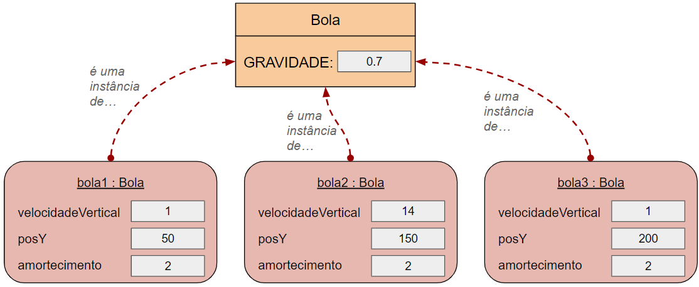

# Escrevendo documentação de classes {background-color="#40666e"}

##

Quando estamos trabalhando em nossos projetos, 

- é importante escrevermos a **documentação de nossas classes**, à medida que desenvolvemos o código.

- Muitas vezes programadores não levam a sério a documentação, o que pode levar a sérios problemas.

. . .

Se você não fornecer documentação suficiente, pode ser difícil para outro programador entender suas classes.

- Muitas vezes esse outro programador pode ser você mesmo :)

##

Sem documentação, precisamos ler o código da classe para tentar entender como ela funciona.

- Isso pode funcionar em um projeto pequeno de estudante.
- Mas cria problemas em projetos do mundo real.

. . .

É muito comum que sistemas comerciais tenham centenas de milhares de linhas de código.

- Imagine que você tivesse que ler todas essas linhas para entender como o código funciona.
- Seria impossível!

## 

É possível usar as classes da biblioteca Java, como `HashSet` e `Random`, olhando apenas a documentação delas.

- Nós nunca precisamos olhar o código-fonte destas classes.

. . . 

Isso funciona porque as classes estão suficientemente bem documentadas.

- Seria muito mais difícil usar essas classes, se precisássemos ler e entender o código-fonte delas primeiro.

##

Em uma equipe de desenvolvimento de software, a implementação das classes é geralmente dividida entre vários programadores.

- Um programador poderia implementar a classe `SistemaDeSuporte`, por exemplo, e outro a classe `LeitorDeEntrada`.
- Portanto, você pode precisar implementar uma classe enquanto chama métodos de outras classes.

##

Assim, o mesmo raciocínio usado para as classes da biblioteca Java vale para as classes que você escreve.

- Se podemos usar as classes sem ter que ler e entender toda a implementação, nossa tarefa fica mais fácil.
- Nós precisamos apenas da interface das classes e não da implementação.

. . .

Portanto, precisamos escrever boa documentação de classes também para as nossas próprias classes.

##

A documentação das classes pode ser útil inclusive para as ferramentas de IA.

- Que podem usá-la para complementar o entedimento do código.

. . .

::: {.callout-tip title="Conceito" icon=false}
A **documentação** de uma classe deve ser detalhada o suficiente para que outros programadores
consigam usar a classe sem precisar ler o código fonte.
:::

##

O Java tem uma ferramenta chamada [javadoc](.alert) que gera documentação a partir de comentários no código.

- Toda a documentação oficial das classes da biblioteca Java é gerada com o javadoc.

. . .

O BlueJ usa o javadoc para gerar documentação das classes.

- Com o código de uma classe aberto no BlueJ, podemos acessar a caixa de opções no canto superior direito e mudar de _código-fonte_ para _documentação_.

- Ou podemos também usar o menu `Ferramentas` &rarr; `Documentaçao do Projeto` para gerar a documentação de todas as classes do projeto.

##

::: {.callout-note title="Exercício" icon=false}
Experimente acessar a documentação da classe `SistemaDeSuporte` no BlueJ.
:::

. . .

Os arquivos HTML gerados ficam em uma pasta `doc` dentro do projeto e podem ser abertos em qualquer navegador.

##

A **documentação de uma classe** deveria incluir, no mínimo:

- O nome da classe.
- Um comentário descrevendo o objetivo e as características da classe.
- Um número de versão.
- O nome do(s) autor(es).
- Documentação para cada construtor e para cada método.

##

A **documentação de todo construtor e método** deve incluir, no mínimo:

- O nome do método.
- O tipo de retorno.
- Os nomes e tipos dos parâmetros.
- Uma descrição do objetivo e função do método.
- Uma descrição de cada parâmetro.
- Uma descrição do valor retornado.

##

Além disso, cada projeto deveria ter um comentário geral sobre o projeto.

- Geralmente dentro de um arquivo `README` na pasta raiz do projeto.
- No BlueJ podemos fazer esse comentário de projeto abrindo o arquivo que fica no 
canto superior esquerdo do diagrama de classses. 

##

Alguns elementos da documentação podem ser sempre extraídos do código-fonte.

- Como os nomes e parâmetros dos métodos, por exemplo.
- Já a descrição da classe e dos métodos demanda mais atenção já que pode ser facilmente esquecida, ou ficar incompleta.

##

No Java, comentários `Javadoc` são escritos com um símbolo especial de comentário.

::: {.halfincfontsize}
```{.java code-line-numbers="false"}
/**
 * Este é um comentário Javadoc.
 * Ele pode ter várias linhas.
 */
```
:::

##

O comentário deve ter `/**` no início e `*/` no final para ser reconhecido como um comentário `javadoc`.

- Se o comentário vem imediatamente antes da declaração da classe, ele é lido como a descrição da classe.
- Se ele está logo acima de uma assinatura de método, é considerado como um comentário do método.

. . .

Como exatamente o comentário deve ser formatado para gerar a documentação pode variar de acordo com as
ferramentas de cada linguagem de programação.

##

No caso do `javadoc` várias palavras-chave especiais estão disponíveis para formatar a documentação.

- Essas chaves começam com `@`, como, por exemplo:
  - `@version`
  - `@author`
  - `@param`
  - `@return`

## 

::: {.callout-note title="Exercício" icon=false}
Encontre exemplos de palavras-chave `javadoc` no projeto do sistema de suporte e 
verifique como eles influenciam a formatação da documentação.

Experimente fazer alterações e conferir o resultado na documentação gerada.
:::

. . .

::: {.callout-note title="Exercício" icon=false}
::: {.nonincremental}
Documente adequadamente as classes do projeto de suporte técnico e gere a documentação
usando o BlueJ.
:::
:::


# Encapsulamento {background-color="#40666e"}

## Público vs. Privado

. . .

Vocês já notaram que usamos a todo momento as palavras-chave `public` e `private` em nossos programas em Java, como mostrado no exemplo abaixo:

. . .

::: {.halfincfontsize}
```{.java code-line-numbers="false"}
    // declaração de atributos
    private int numeroDeAssentos;
    // métodos
    public void definirIdade(int novaIdade) {
      ...
    }    
    private int calcularMedia() {
      ...
    }
```
:::

##

Chegou a hora de entendermos para que essas palavras-chaves servem.

. . .

Nós chamamos essas palavras-chave de [modificadores de acesso]{.alert}.

- elas definem a visibilidade de atributos, construtores e métodos.

##

Se um método, por exemplo, é **público**:

- Ele pode ser chamado de dentro da mesma classe **e também** a partir de outra classe.

. . .

Já métodos **privados**, por outro lado,

- **Só** podem ser chamados de **dentro** da mesma classe onde foram declarados.
- Eles não são visíveis para as outras classes.

##

Como agora já conhecemos os conceitos de **interface** e **implementação** fica mais fácil entendermos o objetivo dessas palavras-chave.

. . .

Lembre-se que a **interface de uma classe** é o conjunto de detalhes que um programador que vai usar a classe precisa ver.

- Ela fornece informações sobre como usar a classe.
  - E inclui assinaturas e comentários de construtores e métodos.
- Nós também dizemos que a **interface** é a [parte pública]{.alert} da classe.
- Seu objetivo é definir [o que]{.alert} **a classe faz**.

##

Já a **implementação** é a parte da classe que define precisamente [como]{.alert} **a classe funciona**.

- Os corpos dos métodos, contendo comandos Java, e muitos atributos são parte da implementação.
- Nós também podemos dizer que ela é a [parte privada]{.alert} da classe.
- Quem usa a classe não precisa conhecer a implementação.
- Inclusive, há boas razões para que o programador não possa fazer uso desse conhecimento (como veremos mais adiante).

##

Portanto, podemos dizer que:

- A palavra-chave `public` declara que um **membro** (atributo ou método) de uma classe faz parte de sua **interface**.
  - Ou seja, é visível publicamente.
- Já a palavra-chave `private` declara que um **membro** é parte da implementação.
  - Ou seja, está escondida de acesso externo.

. . .

::: {.callout-tip title="Conceito" icon=false}
**Modificadores de acesso** definem a visibilidade de um atributo, construtor ou método.
Elementos públicos são acessíveis de dentro da classe e a partir de outras classes;
já elementos privados são acessíveis somente de dentro da mesma classe.
:::

## Encapsulamento

Em muitas linguagens OO, a implementação de uma classe (seus detalhes internos) é ocultada de outras classes.

. . .

Isso tem a ver com duas questões.

1. Ao **usar uma classe** um programador **não deveria [precisar conhecer]{.alert}** seus detalhes internos.
  - Isso tem a ver com a **modularização** e **abstração** que já discutimos antes.
  - Se fosse necessário saber os detalhes de todas as classes, seria impossível desenvolver grandes sistemas.

##

2. Outra questão é que, ao **usar uma classe**, um programador **não deveria [ter permissão de conhecer]{.alert}** seus detalhes internos.

- Apesar de também ter a ver com modularização, a ideia aqui é que a linguagem não deveria permitir o acesso à parte privada de uma classe a partir de comandos em outras classes.
- Isso garante que uma classe não dependa de **como** exatamente uma outra classe está implementada.

## {auto-animate=true}

Esta última questão é muito importante para a manutenção de sistemas.

- Quando precisamos incluir novas funcionalidades ou corrigir bugs é muito comum precisarmos alterar uma classe.
- O ideal é que a alteração de uma classe não provoque alterações em outras classes.
  - Isso tem a ver com o que chamamos de **acoplamento**.

## {auto-animate=true}

Isso tem a ver com o que chamamos de **acoplamento**.

- Se a alteração em uma classe não provoca alterações em outras classes, temos um baixo acoplamento.
- E isso é muito bom, porque torna o trabalho de manutenção muito mais fácil.
- Já que em vez de entender e alterar várias classes, o programador precisa trabalhar em apenas em uma.

##

Suponha, por exemplo, que a equipe que mantém a linguagem Java faça uma melhoria na implementação da classe `ArrayList`.

- O ideal é que essa melhoria não afete os nossos códigos que usam a classe `ArrayList`.
- Repare que isso só é possível porque nosso código não faz referência à implementação da classe `ArrayList`.

##

Para ficar mais claro, quando uma classe A utiliza um objeto de uma classe B.

- Não é bem o programador que não pode conhecer a parte interna (implementação) da classe B.
- Na verdade é a classe A que não pode conhecer (ou seja, depender) dos detalhes internos da classe B.
- Repare que pode acontecer do mesmo programador implementar tanto a classe A quanto a classe B.
  - Mas de toda forma, as classes ainda deveriam ter **baixo acoplamento**.


##

Esta questão de **acoplamento** é tão importante que vamos discuti-la, em detalhes, no Capítulo 7.

- Por enquanto, o mais importante é entender que a palavra-chave `private` garante o [*princípio da ocultação de informações*]{.alert}
  - ao impedir que outras classes acessem a parte privada da classe.
- Isso garante o baixo acoplamento, tornando a aplicação mais modular e facilitando a manutenção.

##

Nós também podemos chamar o *princípio da ocultação de informações* de [encapsulamento]{.alert}.

- Esse **conceito** é **fundamental na Programação Orientada a Objetos**.
- E talvez seja a única parte do livro que não gosto muito, pois acho que ele não dá a ênfase necessária a esse conceito.

##

O termo **encapsulamento** vem da palavra *cápsula*, que é definida no dicionário como:


. . .

A ideia é que a implementação da classe (seus detalhes internos) sejam encapsulados (protegidos).

- E a classe exponha apenas sua interface.

##

:::: {.columns}

::: {.column width="70%"}
Um bom exemplo que ilustra o encapsulamento é um telefone fixo comum.

- Você usa o telefone através de sua interface (os botões) e não precisa saber como é o funcionamento interno.
:::

::: {.column width="30%"}

:::

::::

. . .

:::: {.columns}

::: {.column width="20%"}

:::

::: {.column width="80%"}
A mesma analogia pode ser feita com um caixa eletrônico.

- Você usa as opções que aparecem pra você (interface) mas não precisa saber como isso funciona internamente.
- Você só vê o que a interface disponibiliza.
:::

::::


## Métodos privados

Muitos dos métodos que vimos até agora eram públicos.

- Isso garante que eles podem ser chamados a partir de outras classes.
- Mas **podemos** também **ter métodos privados**.
  - Como os métodos `imprimirBoasVindas` e `imprimirDespedida` da classe `SistemaDeSuporte`.

##

Nós declaramos um método como **público** para fornecer operações para quem usa a classe.

- E declaramos como **privado** para dividir o código em trechos menores, facilitando o entendimento e a leitura.
  - Veja que não faria sentido chamar o método `imprimirBoasVindas` de fora da classe `SistemaDeSuporte`.
  - Mas o código do método `iniciar` fica mais claro quando separamos sua tarefa em subtarefas.

## Métodos privados

Nós também usamos métodos privados quando um trecho de código é usado em mais de um lugar na classe.

- Pois, dessa forma, evitamos escrever o mesmo trecho de código mais de uma vez.
- E, em vez disso, chamamos o método privado em mais de um lugar.


## Atributos sempre privados!

. . .

A linguagem Java permite que atributos sejam declarados como privados ou públicos.

- Mas você deve ter notado que nos exemplos **sempre declaramos os atributos como privados**.
- Isso é fundamental para respeitar o conceito de **encapsulamento**.

##

Declarar atributos públicos quebra o *princípio da ocultação das informações*.

- Portanto, mesmo que a linguagem Java permita atributos públicos, isso é considerado um estilo ruim de programação.
- Há linguagens que nem permitem a existência de atributos públicos.
  - Enquanto outras não implementam completamente o conceito de encapsulamento, o que viola a teoria de POO.
  - Esse é o principal motivo para eu não adotar a linguagem Python na disciplina :)

##

Outro motivo para manter os atributos privados é permitir que a **classe tenha** um maior **controle sobre o estado dos seus objetos**.

- Se o atributo é encapsulado e só é acessível através de métodos de acesso (obter/get) e modificadores (definir/set),
- a classe pode garantir que o atributo nunca tenha um valor inválido ou inconsistente.

##

Para deixar o conceito mais claro, suponha que uma classe `Circulo` tenha um atributo chamado `diametro`.

- E, como o programador faltou às aulas de POO, ele definiu o atributo como público.
- Com isso, qualquer classe consegue acessar e alterar o valor do diâmetro de um círculo.
  - Fazendo, por exemplo:

. . .

::: {.halfincfontsize}
```{.java code-line-numbers="false"}
Circulo circulo = new Circulo(10);
circulo.diametro = 30;
```
:::

##

Mas repare que isso abre brecha para a seguinte situação:

::: {.halfincfontsize}
```{.java code-line-numbers="false"}
int d = calcularNovoDiametro();
circulo.diametro = d;
```
:::

. . .

O que aconteceria se, por algum erro, o método `calcularNovoDiametro` retornasse um valor negativo?

- O círculo acabaria ficando com um diâmetro negativo, mas isso não faz sentido.

. . .

E como isso poderia ser corrigido?

## {auto-animate=true}

Além, é claro, de corrigir o método de cálculo, seria uma boa ideia colocar um `if` antes de alterar o diâmetro:

- Para garantir que o círculo nunca ficasse com valor negativo por algum outro erro.

. . .

::: {.halfincfontsize}
```{.java code-line-numbers="false"}
int d = calcularNovoDiametro();
if (d > 0) {
    circulo.diametro = d;
}
```
:::

. . .

Mas repare que podem existir diversos trechos de código no programa que alteram o valor do diâmetro.

## {auto-animate=true}

::: {.halfincfontsize}
```{.java code-line-numbers="false"}
int d = calcularNovoDiametro();
if (d > 0) {
    circulo.diametro = d;
}
```
:::

Mas repare que podem existir diversos trechos de código no programa que alteram o valor do diâmetro.

- E seria necessário colocar essa verificação em todos esses lugares.

. . . 

E pior, no futuro, quem fizesse algum código novo, também precisaria se lembrar de fazer a verificação.

##


Outro problema é que tudo isso está acontecendo sem o conhecimento da classe `Circulo`.

- Mas é ela quem deveria ser responsável por garantir que o estado dos seus objetos é sempre válido.

## 

Vamos comparar com uma versão bem implementada da classe `Circulo`:

- ela teria o atributo `diametro` privado;
- e um método modificador para alterar o diâmetro.


. . .

::: {.halfincfontsize}
```{.java code-line-numbers="false"}
public class Circulo {
    private int diametro;
    ...
    public void definirDiametro(int diametro) {
        this.diametro = diametro;
    }
}
```
:::

##

Repare que, com isso, o diâmetro só pode ser alterado através da chamada do método `definirDiametro`.

- E agora fica mais fácil evitar o problema anterior.
- Pois basta colocarmos a verificação (`if`) no método `definirDiametro`.
- Não é necessário tratar todos os lugares que chamam o método `definirDiametro`.

. . .

E, no futuro, em códigos novos, ninguém precisará se lembrar de ter que fazer essa verificação.

## 

Em resumo:

- [Atributos deveriam ser sempre privados!]{.alert}

. . .

::: {.callout-tip title="Conceito" icon=false}
**Encapsulamento** (ou *ocultamento de informações*) é um princípio que define que os detalhes internos da implementação de uma classe deveriam ser ocultados das outras classes.
Isso permite uma melhor modularização de uma aplicação.
:::

# Projeto no Greenfoot {background-color="#40666e"}

## 

Aproveitando o fato de que vamos usar o [Greenfoot]{.alert} para o trabalho prático da disciplina,

- usaremos um projeto do **Greenfoot** para aprender os próximos conceitos de POO.

. . .

Aprenderemos sobre:

- **Atributos estáticos**
- **Métodos estáticos**
- **Constantes**

##

Para começar, baixe o projeto [bolas-quicando](https://github.com/ufla-ipoo/bolas-quicando).

- Vamos aproveitar esse projeto para também conhecer um pouco mais sobre o Greenfoot.

. . .

Abra o projeto no Greenfoot.


- Execute o programa e veja o que acontece.


##

::: {.callout-note title="Exercício" icon=false}
::: {.nonincremental}
**Execute** o projeto e logo em seguida **pause o programa** (antes das bolas pararem de quicar).
**Clique então com o botão direito** em uma das bolas.

- Veja que as opções são as mesmas do BlueJ quando clicamos em um objeto na bancada de objetos.
- Você pode clicar em **Inspecionar** para ver os valores dos atributos.
- E você pode também **chamar métodos** do objeto.
:::
::: 

##

::: {.callout-note title="Exercício" icon=false}
Abra a classe `Mundo` e veja o código do método `prepare`.
Repare que ele cria duas bolas e depois cria 10 objetos da classe `Chao`.

::: {.nonincremental}
Altere o método para que o programa tenha uma terceira bola.

- Crie a bola com diâmetro igual a 30 e posição vertical (y) 150.
- Posicione a bola na posição (300, 150).
:::
:::

##

Antes de continuarmos, vamos conhecermos alguns métodos diponíveis no Greenfoot
que não tínhamos visto no tutorial.

- `getImage`: retorna a imagem usada para o objeto (definida na hora que criamos a classe).
- `getImage().scale`: permite mudar o tamanho da imagem do objeto.
- `setLocation`: muda a posição do ator no mundo (coordenadas X e Y).
- `isTouching`: indica se o ator está colidindo com algum objeto da classe passada.

##

Agora leia o código da classe `Bola` e tente entender como ela funciona.

# Atributos estáticos e constantes {background-color="#40666e"}

## 

Ao avaliar o código da classe `Bola` você viu alguma palavra-chave nova do Java?

- Repare a declaração do atributo `GRAVIDADE`.

. . .

::: {.callout-note title="Exercício" icon=false}
Experimente alterar o valor do atributo `GRAVIDADE` para 0.4 e 0.9, por exemplo.

Execute o programa para cada alteração e veja o que acontece de diferente.
:::

##

O atributo `GRAVIDADE` é declarado da seguinte forma:

::: {.halfincfontsize}
```{.java code-line-numbers="false"}
    private static final double GRAVIDADE = 0.7;
```
:::

. . .

Há duas palavras-chave novas nessa declaração: 

- `static` e `final`

## Atributos estáticos

A palalavra-chave `static` do Java serve para declarar [atributos estáticos]{.alert}.

- Atributos desse tipo são guardados na própria classe, não nos objetos.
  - Ele são também chamados de [variáveis de classe]{.alert}.
- Isso torna esses atributos muito diferentes dos atributos comuns que vimos até agora.
  - Lembrando que os atributos comuns são também chamados de **variáveis de instância**.

## 

O diagrama abaixo ilustra bem a diferença entre os atributos comuns e estáticos.

{.r-stretch}

## 

{.r-stretch}

Os **atributos comuns** (`velocidadeVertical`, `posY` e `amortecimento`) são guardados nos objetos:

- Como criamos três objetos, há **três espaços na memória** para cada um desses atributos.

## 

{.r-stretch}

Já o **atributo estático** `GRAVIDADE` é guardado na classe:

- Com isso, existe sempre **um único espaço na memória** para ele, independente da quantidade de objetos criados.

## 

Os **atributos estáticos** podem ser acessados normalmente dentro de qualquer método da classe.

- Isso significa que todos os objetos compartilham o mesmo atributo.
- Se um objeto alterar o valor do atributo estático, esse valor será usado para todos os objetos.
  - Já que existe um único valor na memória.

. . .

Geralmente usamos atributos estáticos quando todos os objetos da classe devem ter o mesmo valor para o atributo.

- Com isso, evitamos desperdiçar memória guardando o mesmo valor repetidas vezes para cada objeto.

##

::: {.callout-note title="Exercício" icon=false}
Como um atributo estático poderia ser usado para contabilizar a quantidade de objetos criados em uma classe?

Por exemplo, como a própria classe `Bola` poderia contar quantas bolas foram criadas durante o programa?
::: 

## Constantes 

[Constantes]{.alert} são parecidas com variáveis,

- mas a diferença é que seus valores não podem ser alterados depois de inicializados.
- Definimos constantes em Java usando a **palavra-chave** `final`.

##

Suponha, por exemplo, a seguinte declaração de constante:

::: {.halfincfontsize}
```{.java code-line-numbers="false"}
    private final int TAMANHO = 30;
```
:::

- Veja que é uma declaração de atributo.
- Mas tem a palavra-chave `final` antes do tipo do atributo.

. . .

Obs.: por convenção, escrevemos os nomes das constantes com todas as letras maiúsculas.

##

Constantes podem ser inicializadas na própria linha da declaração, como no exemplo dado:

::: {.halfincfontsize}
```{.java code-line-numbers="false"}
    private final int TAMANHO = 30;
```
:::

- Neste caso, todos os objetos teriam o mesmo valor.
- E, portanto, seria mais intessante que o atributo `TAMANHO` fosse estático.

##

Mas constantes podem ser inicializadas nos construtores em vez de ser na declaração.

- Como isso, cada objeto poderia ter um valor diferente para o atributo `TAMANHO`.
  - Inicializado, por exemplo, a partir de um valor recebido por parâmetro no construtor.
  - A ideia seria que o objeto não poderia ter seu tamanho alterado depois de sua criação.
- Nesse caso, não faria sentido declarar o atributo como estático.

## 

É mais comum usarmos constantes quando elas têm o mesmo valor para todos os objetos.

- Portanto, é mais comum ter constantes estáticas, do que como atributos comuns.
- Como é o caso do atributo `GRAVIDADE` da classe `Bola`.

#

::: {.callout-note title="Exercício" icon=false}
Repare que o atributo `amortecimento` da classe `Bola` é constante, mas não é estático.
Com isso, as bolas poderiam ter valores diferentes de amortecimento.

Altere então a classe `Bola` de forma que o valor do atributo `amortecimento` 
seja recebido por parâmetro no construtor.
Você precisará, é claro, alterar a criação das bolas na classe `Mundo`.

Experimente usar valores diferentes para cada bola (ex: 2, 3 e 4).
Execute o programa para testar.

O que acontece com bolas que têm maior amortecimento?
:::

# Métodos estáticos {background-color="#40666e"}

## 

Todos os métodos que implementamos até agora são **métodos de instância** (de objetos).

- Pois eles são chamados usando objetos.

. . .

Mas nós podemos também ter métodos que são chamados usando a classe, em vez de objetos.

- São os [métodos estáticos]{.alert}.
- Assim como os atributos estáticos, os métodos estáticos pertencem à classe e não aos objetos.

## 

Nós podemos definir **métodos estáticos** usando a palavra-chave `static` na assinatura do método.

##

Suponha, por exemplo, que uma classe `Calendario` tenha o método estático abaixo: 

::: {.halfincfontsize}
```{.java code-line-numbers="false"}
    public static int obterNumeroDeDiasDoMesAtual() {
        . . .
    }
```
:::

. . .

Nós poderíamos chamar esse método usando o comando abaixo:

- Repare que usamos o **nome da classe** antes do `.` para chamar o método, **em vez de usar um objeto**.

::: {.halfincfontsize}
```{.java code-line-numbers="false"}
    int dias = Calendario.obterNumeroDeDiasDoMesAtual();
```
:::

## 

Podemos encontrar vários exemplos de métodos estáticos na classe `Math` do Java.

- Ela possui métodos, por exemplo, para encontrar o máximo ou o mínimo entre dois números.
  - Ou ainda calcular seno e cosseno, por exemplo.

. . .

::: {.halfincfontsize}
```{.java code-line-numbers="false"}
    int maximo = Math.max(numeroA, numeroB);
    double valor = Math.cos(angulo);
```
:::


##

::: {.halfincfontsize}
```{.java code-line-numbers="false"}
    int maximo = Math.max(numeroA, numeroB);
    double valor = Math.cos(angulo);
```
:::

Repare que esses métodos dependem apenas dos parâmetros passados.

- Eles não dependem de atributos de um possível objeto `Math`, ou seja, não dependem do estado de um objeto.
- Geralmente é nesses casos que usamos métodos estáticos.

## 

A classe `Math` do Java possui também exemplos de uso de constantes.

- O valor de `PI`, por exemplo, pode ser acessado com o comando `Math.PI`.
- Repare que estamos acessando o atributo diretamente, usando o nome da classe, em vez de um objeto.
  - Da mesma forma que usamos para chamar métodos estáticos.
- Nós conseguimos fazer isso porque PI é declarado como uma constante pública.

##

Mas não seria uma falha de encapsulamento declarar um atributo público?

- Note que não há falha de encapsulamento em declarar um atributo público, se ele for uma constante.
- Já que não seria possível alterar seu valor de fora da classe.

## 

Você já usou métodos estáticos antes, sem saber.

- Repare como os métodos abaixo são chamados.

. . .

::: {.halfincfontsize}
```{.java code-line-numbers="false"}
Greenfoot.isKeyDown("left");

Greenfoot.playSound("comendo.wav");

Greenfoot.getRandomNumber(90);
```
:::

##

::: {.halfincfontsize}
```{.java code-line-numbers="false"}
Greenfoot.isKeyDown("left");

Greenfoot.playSound("comendo.wav");

Greenfoot.getRandomNumber(90);
```
:::

Em todas essas chamadas nós usamos o nome da classe `Greenfoot` para chamar o método.

- Isso porque todos esses métodos são estáticos.
- Todos eles implementam ações que dependem apenas dos parâmetros passados
  - (não dependem do estado de um objeto).

## Limitações dos métodos estáticos 

É importante sabermos que os **métodos estáticos** (métodos de classe) têm **limitações**.

- Como eles pertencem à classe e não aos objetos, eles não podem acessar atributos comuns (variáveis de instância).
- Eles podem acessar apenas **atributos estáticos** (variáveis de classe).

. . .

Da mesma forma, métodos estáticos não podem chamar métodos de instância da mesma classe.

- Podem chamar apenas outros métodos estáticos.

## Limitações dos métodos estáticos 

Por que você acha que essas limitações existem?

- Imagine que um método estático qualquer (vamos chamar de `metodoA`), de uma classe `ClasseX` acessasse um atributo comum.
- Tente imaginar o que aconteceria se você fizesse uma chamada `ClasseX.metodoA()` sem ter criado nenhum objeto da classe.
  - E se existissem vários objetos da classe?

. . .

E o que isso tem a ver com um método estático não poder chamar um método de instância?


## 

::: {.callout-note title="Exercício" icon=false}
Altere a declaração do atributo `GRAVIDADE` da classe `Bola` de forma que ele não seja mais uma constante.
Mas, mantenha a inicialização do atributo na declaração.

Crie um **método modificador** que permita alterar o valor do atributo.

Execute o programa e pause-o antes das bolas pararem de quicar.
Clique em uma das bolas e chame o método que você criou, informando um novo valor para a gravidade.

Continue a execução do programa e repare que acontece. 
A gravidade foi alterada só para a bola que você chamou o método, ou para todas elas?

Depois que as bolas pararem, pause o programa novamente, e use a opção *Inspecionar* em cada bola para conferir
o valor do atributo `GRAVIDADE`.
(Obs.: na janela de inspeção, use o botão *mostrar campos estáticos*).
::: 
